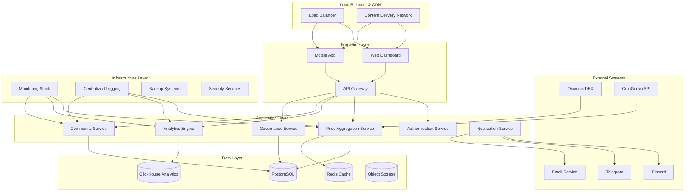
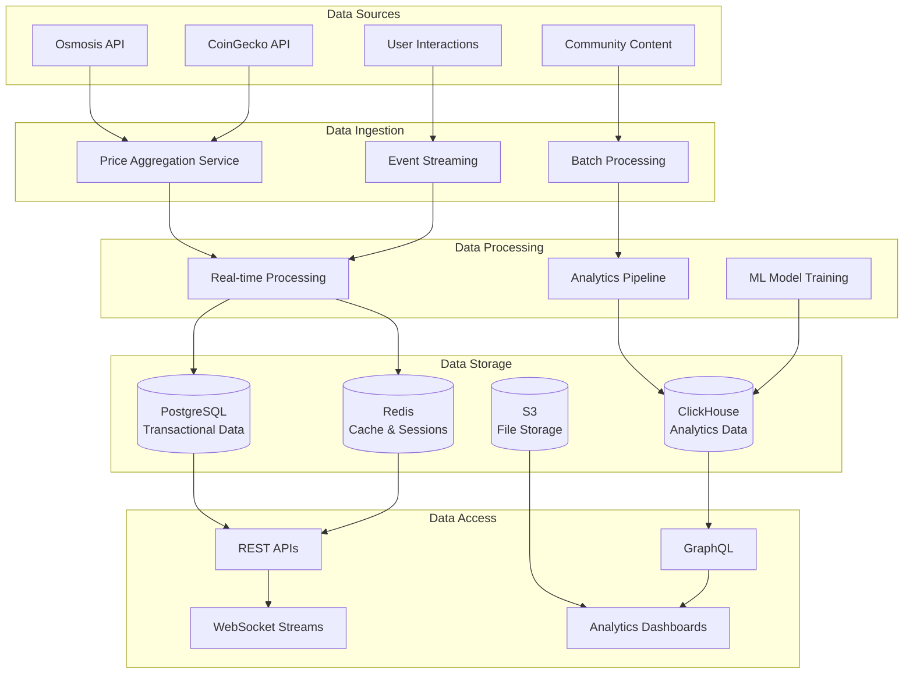
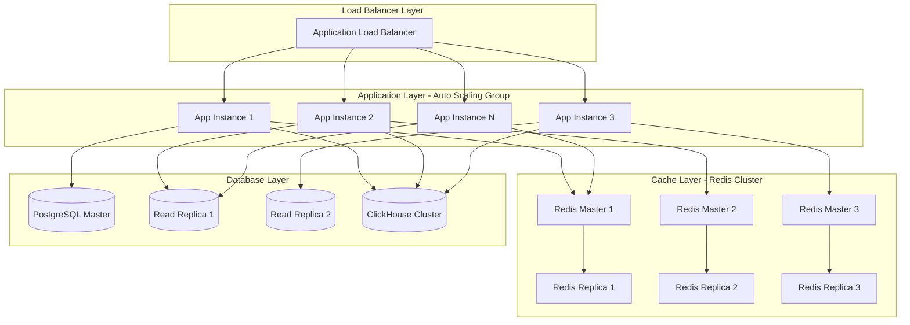

# Architecture Overview: NUAH Soft Peg 1:1 System

**Document Type**: System Architecture Overview  
**Project**: NUAH Token Soft Peg Strategy  
**Version**: 1.0  
**Date**: January 2025  
**Status**: Draft

## Document Control

| Field | Value |
|-------|-------|
| **Document ID** | AO-NUAH-SOFTPEG-001 |
| **Classification** | Architecture Overview |
| **Dependencies** | Technical Specification, Requirements Specification |
| **Related Documents** | Implementation Roadmap, Technical Documentation |
| **Review Cycle** | Monthly |

---

## 1. Executive Summary

### 1.1 System Overview

The NUAH Soft Peg 1:1 System is a community-driven price stability platform designed to maintain the NUAH token's value at approximately 1:1 with USD through transparency, community engagement, and market-based mechanisms. Unlike algorithmic stablecoins that rely on complex economic models, this system leverages community trust, real-time monitoring, and educational initiatives to achieve price stability.

### 1.2 Architectural Principles

```yaml
Core Principles:
  Transparency:
    - Open-source codebase
    - Real-time price and deviation monitoring
    - Public governance and decision-making
    - Comprehensive audit trails
  
  Community-Centric:
    - User-friendly interfaces for all skill levels
    - Educational content and resources
    - Democratic governance mechanisms
    - Inclusive participation opportunities
  
  Scalability:
    - Microservices architecture
    - Horizontal scaling capabilities
    - Cloud-native deployment
    - Performance optimization at every layer
  
  Reliability:
    - 99.9% uptime target
    - Fault-tolerant design
    - Comprehensive monitoring and alerting
    - Disaster recovery procedures
  
  Security:
    - Defense-in-depth security model
    - Regular security audits
    - Encrypted data transmission and storage
    - Access control and authentication
```

### 1.3 High-Level Architecture



---

## 2. System Architecture

### 2.1 Layered Architecture Model

#### 2.1.1 Presentation Layer

```typescript
// Frontend Architecture Pattern
interface PresentationLayer {
  webDashboard: {
    framework: 'React 18 with TypeScript';
    stateManagement: 'Zustand + React Query';
    styling: 'Tailwind CSS + Headless UI';
    bundler: 'Vite';
    testing: 'Vitest + React Testing Library';
  };
  
  mobileApp: {
    framework: 'React Native with TypeScript';
    navigation: 'React Navigation 6';
    stateManagement: 'Zustand + React Query';
    styling: 'NativeWind';
    testing: 'Jest + Detox';
  };
  
  designSystem: {
    components: 'Custom component library';
    tokens: 'Design tokens for consistency';
    accessibility: 'WCAG 2.1 AA compliance';
    responsive: 'Mobile-first responsive design';
  };
}

// Component Architecture
const ComponentHierarchy = {
  App: {
    Router: {
      Layout: {
        Header: ['Navigation', 'UserMenu', 'Notifications'],
        Sidebar: ['MainMenu', 'QuickStats', 'CommunityFeed'],
        Main: {
          Dashboard: ['PriceChart', 'DeviationAlert', 'StabilityScore'],
          Analytics: ['TrendAnalysis', 'PredictiveModels', 'MarketInsights'],
          Community: ['Forum', 'Governance', 'Education'],
          Profile: ['Settings', 'Achievements', 'History']
        },
        Footer: ['Links', 'Status', 'Support']
      }
    }
  }
};
```

#### 2.1.2 API Gateway Layer

```yaml
API Gateway Configuration:
  Technology: Kong Gateway
  
  Features:
    - Rate limiting and throttling
    - Authentication and authorization
    - Request/response transformation
    - Load balancing and service discovery
    - API versioning and routing
    - Monitoring and analytics
  
  Routing Rules:
    /api/v1/auth/*: Authentication Service
    /api/v1/price/*: Price Aggregation Service
    /api/v1/analytics/*: Analytics Engine
    /api/v1/community/*: Community Service
    /api/v1/governance/*: Governance Service
    /api/v1/notifications/*: Notification Service
  
  Security Policies:
    - JWT token validation
    - API key authentication for external clients
    - CORS policy enforcement
    - Request size limits
    - IP whitelisting for admin endpoints
```

#### 2.1.3 Business Logic Layer

```python
# Microservices Architecture
class MicroservicesArchitecture:
    def __init__(self):
        self.services = {
            'price_aggregation': PriceAggregationService(),
            'analytics_engine': AnalyticsEngine(),
            'community_service': CommunityService(),
            'governance_service': GovernanceService(),
            'notification_service': NotificationService(),
            'authentication_service': AuthenticationService()
        }
    
    def get_service_dependencies(self):
        return {
            'price_aggregation': {
                'dependencies': ['external_apis'],
                'consumers': ['analytics_engine', 'notification_service'],
                'data_stores': ['postgresql', 'redis']
            },
            'analytics_engine': {
                'dependencies': ['price_aggregation'],
                'consumers': ['community_service', 'notification_service'],
                'data_stores': ['clickhouse', 'postgresql']
            },
            'community_service': {
                'dependencies': ['authentication_service'],
                'consumers': ['governance_service'],
                'data_stores': ['postgresql', 's3']
            },
            'governance_service': {
                'dependencies': ['authentication_service', 'community_service'],
                'consumers': ['notification_service'],
                'data_stores': ['postgresql']
            }
        }

# Service Communication Patterns
class ServiceCommunication:
    def __init__(self):
        self.patterns = {
            'synchronous': {
                'protocol': 'HTTP/REST',
                'use_cases': ['User queries', 'Real-time data requests'],
                'timeout': '30 seconds',
                'retry_policy': 'Exponential backoff'
            },
            'asynchronous': {
                'protocol': 'Message Queue (RabbitMQ)',
                'use_cases': ['Event processing', 'Background tasks'],
                'delivery': 'At-least-once',
                'dead_letter_queue': 'Enabled'
            },
            'real_time': {
                'protocol': 'WebSocket',
                'use_cases': ['Live price updates', 'Notifications'],
                'connection_management': 'Auto-reconnect',
                'heartbeat': '30 seconds'
            }
        }
```

#### 2.1.4 Data Access Layer

```sql
-- Database Schema Architecture

-- Primary Database (PostgreSQL)
CREATE SCHEMA core;
CREATE SCHEMA community;
CREATE SCHEMA governance;
CREATE SCHEMA analytics;

-- Core Schema - Price and System Data
CREATE TABLE core.price_data (
    id BIGSERIAL PRIMARY KEY,
    timestamp TIMESTAMPTZ NOT NULL,
    source VARCHAR(50) NOT NULL,
    price DECIMAL(18,8) NOT NULL,
    volume DECIMAL(18,8),
    market_cap DECIMAL(18,2),
    deviation_from_peg DECIMAL(8,4),
    created_at TIMESTAMPTZ DEFAULT NOW(),
    INDEX idx_price_timestamp (timestamp),
    INDEX idx_price_source (source),
    INDEX idx_price_deviation (deviation_from_peg)
);

CREATE TABLE core.system_alerts (
    id BIGSERIAL PRIMARY KEY,
    alert_type VARCHAR(50) NOT NULL,
    severity VARCHAR(20) NOT NULL,
    message TEXT NOT NULL,
    metadata JSONB,
    resolved BOOLEAN DEFAULT FALSE,
    created_at TIMESTAMPTZ DEFAULT NOW(),
    resolved_at TIMESTAMPTZ,
    INDEX idx_alerts_type (alert_type),
    INDEX idx_alerts_severity (severity),
    INDEX idx_alerts_created (created_at)
);

-- Community Schema - User and Content Data
CREATE TABLE community.users (
    id UUID PRIMARY KEY DEFAULT gen_random_uuid(),
    username VARCHAR(50) UNIQUE NOT NULL,
    email VARCHAR(255) UNIQUE NOT NULL,
    password_hash VARCHAR(255) NOT NULL,
    profile JSONB,
    reputation_score INTEGER DEFAULT 0,
    created_at TIMESTAMPTZ DEFAULT NOW(),
    last_active TIMESTAMPTZ,
    INDEX idx_users_username (username),
    INDEX idx_users_email (email),
    INDEX idx_users_reputation (reputation_score)
);

CREATE TABLE community.forum_posts (
    id UUID PRIMARY KEY DEFAULT gen_random_uuid(),
    user_id UUID REFERENCES community.users(id),
    title VARCHAR(255) NOT NULL,
    content TEXT NOT NULL,
    category VARCHAR(50),
    tags TEXT[],
    upvotes INTEGER DEFAULT 0,
    downvotes INTEGER DEFAULT 0,
    created_at TIMESTAMPTZ DEFAULT NOW(),
    updated_at TIMESTAMPTZ DEFAULT NOW(),
    INDEX idx_posts_user (user_id),
    INDEX idx_posts_category (category),
    INDEX idx_posts_created (created_at)
);

-- Governance Schema - Proposals and Voting
CREATE TABLE governance.proposals (
    id UUID PRIMARY KEY DEFAULT gen_random_uuid(),
    proposer_id UUID REFERENCES community.users(id),
    title VARCHAR(255) NOT NULL,
    description TEXT NOT NULL,
    proposal_type VARCHAR(50) NOT NULL,
    status VARCHAR(20) DEFAULT 'active',
    voting_start TIMESTAMPTZ NOT NULL,
    voting_end TIMESTAMPTZ NOT NULL,
    votes_for INTEGER DEFAULT 0,
    votes_against INTEGER DEFAULT 0,
    created_at TIMESTAMPTZ DEFAULT NOW(),
    INDEX idx_proposals_status (status),
    INDEX idx_proposals_type (proposal_type),
    INDEX idx_proposals_voting_end (voting_end)
);
```

### 2.2 Data Architecture

#### 2.2.1 Data Flow Architecture



#### 2.2.2 Data Models

```typescript
// Core Data Models
interface PriceData {
  id: string;
  timestamp: Date;
  source: 'osmosis' | 'coingecko' | 'manual';
  price: number;
  volume?: number;
  marketCap?: number;
  deviationFromPeg: number;
  confidence: number;
  metadata?: Record<string, any>;
}

interface StabilityMetrics {
  id: string;
  timestamp: Date;
  stabilityScore: number; // 0-100
  volatilityIndex: number;
  communityConfidence: number;
  marketConditions: 'stable' | 'volatile' | 'trending' | 'crisis';
  riskLevel: 'low' | 'medium' | 'high' | 'critical';
  recommendations: string[];
}

interface CommunityUser {
  id: string;
  username: string;
  email: string;
  profile: {
    displayName?: string;
    avatar?: string;
    bio?: string;
    location?: string;
    website?: string;
  };
  reputation: {
    score: number;
    level: 'newcomer' | 'contributor' | 'expert' | 'leader';
    badges: string[];
    achievements: Achievement[];
  };
  preferences: {
    notifications: NotificationPreferences;
    privacy: PrivacySettings;
    display: DisplaySettings;
  };
  createdAt: Date;
  lastActive: Date;
}

interface GovernanceProposal {
  id: string;
  proposer: string;
  title: string;
  description: string;
  type: 'parameter_change' | 'feature_request' | 'community_initiative' | 'emergency';
  status: 'draft' | 'active' | 'passed' | 'rejected' | 'executed';
  voting: {
    startTime: Date;
    endTime: Date;
    votesFor: number;
    votesAgainst: number;
    abstentions: number;
    quorum: number;
    threshold: number;
  };
  execution: {
    automated: boolean;
    executionTime?: Date;
    executionStatus?: 'pending' | 'success' | 'failed';
    executionDetails?: string;
  };
  createdAt: Date;
  updatedAt: Date;
}
```

### 2.3 Security Architecture

#### 2.3.1 Security Layers

```yaml
Security Architecture:
  
  Network Security:
    - WAF (Web Application Firewall)
    - DDoS protection
    - SSL/TLS encryption (TLS 1.3)
    - VPN access for admin operations
    - Network segmentation
  
  Application Security:
    - JWT-based authentication
    - Role-based access control (RBAC)
    - API rate limiting
    - Input validation and sanitization
    - OWASP Top 10 compliance
  
  Data Security:
    - Encryption at rest (AES-256)
    - Encryption in transit (TLS 1.3)
    - Database access controls
    - PII data anonymization
    - Secure backup procedures
  
  Infrastructure Security:
    - Container security scanning
    - Secrets management (HashiCorp Vault)
    - Infrastructure as Code (IaC)
    - Regular security updates
    - Compliance monitoring
```

#### 2.3.2 Authentication & Authorization

```python
# Authentication Service Architecture
class AuthenticationService:
    def __init__(self):
        self.jwt_handler = JWTHandler()
        self.password_hasher = PasswordHasher()
        self.mfa_service = MFAService()
        self.session_manager = SessionManager()
    
    async def authenticate_user(self, credentials: UserCredentials) -> AuthResult:
        # Multi-factor authentication flow
        user = await self.validate_credentials(credentials)
        if not user:
            return AuthResult(success=False, error="Invalid credentials")
        
        # Check if MFA is required
        if user.mfa_enabled:
            mfa_token = await self.mfa_service.generate_token(user.id)
            return AuthResult(
                success=False,
                mfa_required=True,
                mfa_token=mfa_token
            )
        
        # Generate JWT tokens
        access_token = self.jwt_handler.create_access_token(user)
        refresh_token = self.jwt_handler.create_refresh_token(user)
        
        # Create session
        session = await self.session_manager.create_session(user.id)
        
        return AuthResult(
            success=True,
            user=user,
            access_token=access_token,
            refresh_token=refresh_token,
            session_id=session.id
        )
    
    async def authorize_request(self, token: str, required_permissions: List[str]) -> bool:
        try:
            payload = self.jwt_handler.decode_token(token)
            user_permissions = await self.get_user_permissions(payload['user_id'])
            
            return all(perm in user_permissions for perm in required_permissions)
        except JWTError:
            return False

# Role-Based Access Control
class RBACSystem:
    def __init__(self):
        self.roles = {
            'user': {
                'permissions': [
                    'read:price_data',
                    'read:community_content',
                    'create:forum_posts',
                    'vote:governance_proposals'
                ]
            },
            'moderator': {
                'inherits': ['user'],
                'permissions': [
                    'moderate:forum_posts',
                    'manage:community_content',
                    'create:announcements'
                ]
            },
            'admin': {
                'inherits': ['moderator'],
                'permissions': [
                    'manage:users',
                    'manage:system_settings',
                    'access:admin_dashboard',
                    'execute:emergency_actions'
                ]
            }
        }
```

---

## 3. Infrastructure Architecture

### 3.1 Cloud Infrastructure

#### 3.1.1 Multi-Region Deployment

```yaml
Cloud Infrastructure:
  Primary Region: us-east-1 (N. Virginia)
  Secondary Region: eu-west-1 (Ireland)
  
  Compute Resources:
    Application Servers:
      - Auto Scaling Groups (2-10 instances)
      - Instance Type: t3.large (8 vCPU, 32 GB RAM)
      - Load Balancer: Application Load Balancer
      - Health Checks: HTTP /health endpoint
    
    Database Servers:
      - Primary: db.r5.xlarge (4 vCPU, 32 GB RAM)
      - Read Replicas: 2x db.r5.large (2 vCPU, 16 GB RAM)
      - Backup: Automated daily snapshots
      - Multi-AZ deployment for high availability
    
    Cache Layer:
      - Redis Cluster: cache.r6g.large (2 vCPU, 13 GB RAM)
      - Replication: Master-Slave configuration
      - Persistence: RDB + AOF
    
    Analytics Database:
      - ClickHouse Cluster: 3x c5.2xlarge (8 vCPU, 16 GB RAM)
      - Storage: EBS gp3 with 3000 IOPS
      - Replication: 2x replicas per shard
  
  Storage:
    Object Storage: S3 with CloudFront CDN
    Block Storage: EBS gp3 for databases
    Backup Storage: S3 Glacier for long-term retention
  
  Networking:
    VPC: Custom VPC with public/private subnets
    Security Groups: Restrictive ingress rules
    NAT Gateway: For private subnet internet access
    VPN: Site-to-site VPN for admin access
```

#### 3.1.2 Container Orchestration

```yaml
Kubernetes Configuration:
  Cluster: Amazon EKS
  Node Groups:
    - General Purpose: t3.medium (2-20 nodes)
    - Compute Intensive: c5.large (1-10 nodes)
    - Memory Optimized: r5.large (1-5 nodes)
  
  Namespaces:
    - production: Live application services
    - staging: Pre-production testing
    - monitoring: Observability stack
    - security: Security tools and scanners
  
  Service Mesh: Istio
    - Traffic management
    - Security policies
    - Observability
    - Circuit breaking
  
  Storage Classes:
    - gp3-ssd: General purpose SSD
    - io2-high-iops: High IOPS for databases
    - efs-shared: Shared file system
```

#### 3.1.3 Deployment Pipeline

```yaml
CI/CD Pipeline:
  Source Control: GitHub
  
  Build Pipeline:
    - Code checkout
    - Dependency installation
    - Unit tests (>90% coverage)
    - Security scanning (SAST/DAST)
    - Container image build
    - Image vulnerability scanning
    - Push to container registry
  
  Deployment Stages:
    Development:
      - Automatic deployment on feature branch push
      - Integration tests
      - Performance tests
    
    Staging:
      - Manual approval required
      - Full end-to-end tests
      - Load testing
      - Security penetration testing
    
    Production:
      - Manual approval required
      - Blue-green deployment
      - Canary releases (10% → 50% → 100%)
      - Automated rollback on failure
  
  Quality Gates:
    - Test coverage >90%
    - Security scan pass
    - Performance benchmarks met
    - Code review approval
```

### 3.2 Monitoring & Observability

#### 3.2.1 Monitoring Stack

```yaml
Observability Stack:
  
  Metrics Collection:
    - Prometheus: Time-series metrics
    - Grafana: Visualization and dashboards
    - AlertManager: Alert routing and management
    - Node Exporter: System metrics
    - Application metrics: Custom business metrics
  
  Logging:
    - Fluentd: Log collection and forwarding
    - Elasticsearch: Log storage and indexing
    - Kibana: Log analysis and visualization
    - Log retention: 90 days for application logs
  
  Tracing:
    - Jaeger: Distributed tracing
    - OpenTelemetry: Instrumentation
    - Trace sampling: 1% in production
  
  Synthetic Monitoring:
    - Uptime checks every 30 seconds
    - API endpoint monitoring
    - User journey testing
    - Performance monitoring
  
  Business Metrics:
    - Price deviation alerts
    - Community engagement metrics
    - System performance KPIs
    - Revenue and cost tracking
```

#### 3.2.2 Alerting Strategy

```python
# Alerting Configuration
class AlertingSystem:
    def __init__(self):
        self.alert_rules = {
            'critical': {
                'system_down': {
                    'condition': 'up == 0',
                    'duration': '1m',
                    'channels': ['pagerduty', 'slack', 'email']
                },
                'price_deviation_extreme': {
                    'condition': 'abs(price_deviation) > 0.10',
                    'duration': '5m',
                    'channels': ['pagerduty', 'discord', 'telegram']
                },
                'database_connection_failure': {
                    'condition': 'db_connections_failed > 10',
                    'duration': '2m',
                    'channels': ['pagerduty', 'slack']
                }
            },
            'warning': {
                'high_response_time': {
                    'condition': 'http_request_duration_seconds > 2',
                    'duration': '5m',
                    'channels': ['slack']
                },
                'price_deviation_moderate': {
                    'condition': 'abs(price_deviation) > 0.05',
                    'duration': '10m',
                    'channels': ['discord', 'telegram']
                },
                'high_error_rate': {
                    'condition': 'error_rate > 0.05',
                    'duration': '5m',
                    'channels': ['slack']
                }
            }
        }
    
    def configure_escalation_policies(self):
        return {
            'critical': {
                'immediate': ['on_call_engineer'],
                '15_minutes': ['team_lead', 'backup_engineer'],
                '30_minutes': ['engineering_manager'],
                '60_minutes': ['cto']
            },
            'warning': {
                'immediate': ['team_slack_channel'],
                '30_minutes': ['team_lead']
            }
        }
```

---

## 4. Integration Architecture

### 4.1 External System Integrations

#### 4.1.1 Blockchain & DeFi Integrations

```typescript
// Osmosis Integration
class OsmosisIntegration {
  private client: OsmosisClient;
  private poolId: string;
  
  constructor(config: OsmosisConfig) {
    this.client = new OsmosisClient(config.rpcEndpoint);
    this.poolId = config.poolId;
  }
  
  async getPriceData(): Promise<PriceData> {
    try {
      const pool = await this.client.getPool(this.poolId);
      const price = this.calculatePrice(pool);
      const volume = await this.get24hVolume(this.poolId);
      
      return {
        source: 'osmosis',
        price,
        volume,
        timestamp: new Date(),
        confidence: this.calculateConfidence(pool)
      };
    } catch (error) {
      throw new IntegrationError('Failed to fetch Osmosis data', error);
    }
  }
  
  private calculatePrice(pool: Pool): number {
    // Implement price calculation based on pool reserves
    const [tokenA, tokenB] = pool.poolAssets;
    return Number(tokenB.token.amount) / Number(tokenA.token.amount);
  }
  
  private async get24hVolume(poolId: string): Promise<number> {
    const now = new Date();
    const yesterday = new Date(now.getTime() - 24 * 60 * 60 * 1000);
    
    const swaps = await this.client.getSwapHistory({
      poolId,
      startTime: yesterday,
      endTime: now
    });
    
    return swaps.reduce((total, swap) => total + Number(swap.tokenInAmount), 0);
  }
}

// CoinGecko Integration
class CoinGeckoIntegration {
  private apiKey: string;
  private baseUrl = 'https://api.coingecko.com/api/v3';
  
  constructor(apiKey: string) {
    this.apiKey = apiKey;
  }
  
  async getMarketData(coinId: string): Promise<MarketData> {
    const response = await fetch(
      `${this.baseUrl}/coins/${coinId}?localization=false&tickers=false&market_data=true&community_data=false&developer_data=false`,
      {
        headers: {
          'X-CG-Pro-API-Key': this.apiKey
        }
      }
    );
    
    if (!response.ok) {
      throw new IntegrationError('CoinGecko API request failed');
    }
    
    const data = await response.json();
    
    return {
      price: data.market_data.current_price.usd,
      marketCap: data.market_data.market_cap.usd,
      volume24h: data.market_data.total_volume.usd,
      priceChange24h: data.market_data.price_change_percentage_24h,
      lastUpdated: new Date(data.market_data.last_updated)
    };
  }
}
```

#### 4.1.2 Communication Platform Integrations

```python
# Discord Integration
class DiscordIntegration:
    def __init__(self, webhook_url: str, bot_token: str):
        self.webhook_url = webhook_url
        self.bot_token = bot_token
        self.client = discord.Client()
    
    async def send_price_alert(self, alert: PriceAlert) -> bool:
        embed = discord.Embed(
            title=f"🚨 Price Alert: {alert.severity.upper()}",
            description=alert.message,
            color=self.get_alert_color(alert.severity)
        )
        
        embed.add_field(
            name="Current Price",
            value=f"${alert.current_price:.4f}",
            inline=True
        )
        
        embed.add_field(
            name="Deviation",
            value=f"{alert.deviation:+.2%}",
            inline=True
        )
        
        embed.add_field(
            name="Timestamp",
            value=alert.timestamp.strftime("%Y-%m-%d %H:%M:%S UTC"),
            inline=True
        )
        
        try:
            async with aiohttp.ClientSession() as session:
                await session.post(
                    self.webhook_url,
                    json={"embeds": [embed.to_dict()]}
                )
            return True
        except Exception as e:
            logger.error(f"Failed to send Discord alert: {e}")
            return False
    
    def get_alert_color(self, severity: str) -> int:
        colors = {
            'low': 0x00ff00,      # Green
            'medium': 0xffff00,   # Yellow
            'high': 0xff8000,     # Orange
            'critical': 0xff0000  # Red
        }
        return colors.get(severity, 0x808080)  # Default gray

# Telegram Integration
class TelegramIntegration:
    def __init__(self, bot_token: str, chat_id: str):
        self.bot_token = bot_token
        self.chat_id = chat_id
        self.base_url = f"https://api.telegram.org/bot{bot_token}"
    
    async def send_message(self, message: str, parse_mode: str = "Markdown") -> bool:
        payload = {
            "chat_id": self.chat_id,
            "text": message,
            "parse_mode": parse_mode,
            "disable_web_page_preview": True
        }
        
        try:
            async with aiohttp.ClientSession() as session:
                response = await session.post(
                    f"{self.base_url}/sendMessage",
                    json=payload
                )
                return response.status == 200
        except Exception as e:
            logger.error(f"Failed to send Telegram message: {e}")
            return False
    
    def format_price_alert(self, alert: PriceAlert) -> str:
        emoji = {
            'low': '🟢',
            'medium': '🟡',
            'high': '🟠',
            'critical': '🔴'
        }.get(alert.severity, '⚪')
        
        return f"""
{emoji} *NUAH Price Alert*

*Severity:* {alert.severity.upper()}
*Current Price:* ${alert.current_price:.4f}
*Deviation:* {alert.deviation:+.2%}
*Time:* {alert.timestamp.strftime('%Y-%m-%d %H:%M:%S UTC')}

{alert.message}

[View Dashboard](https://nuah.example.com/dashboard)
        """.strip()
```

### 4.2 API Design

#### 4.2.1 RESTful API Architecture

```yaml
API Design Principles:
  
  REST Standards:
    - HTTP methods: GET, POST, PUT, DELETE, PATCH
    - Status codes: Proper HTTP status code usage
    - Resource naming: Plural nouns, hierarchical structure
    - Versioning: URL path versioning (/api/v1/)
  
  Response Format:
    Success:
      {
        "success": true,
        "data": { ... },
        "meta": {
          "timestamp": "2025-01-01T00:00:00Z",
          "version": "1.0",
          "requestId": "uuid"
        }
      }
    
    Error:
      {
        "success": false,
        "error": {
          "code": "VALIDATION_ERROR",
          "message": "Invalid input parameters",
          "details": { ... }
        },
        "meta": {
          "timestamp": "2025-01-01T00:00:00Z",
          "version": "1.0",
          "requestId": "uuid"
        }
      }
  
  Pagination:
    - Cursor-based pagination for large datasets
    - Limit parameter (max 100, default 20)
    - Include total count when feasible
  
  Rate Limiting:
    - 1000 requests/hour for authenticated users
    - 100 requests/hour for anonymous users
    - Burst allowance: 50 requests/minute
```

#### 4.2.2 API Endpoints

```typescript
// API Endpoint Definitions
interface APIEndpoints {
  // Price Data Endpoints
  'GET /api/v1/price/current': {
    response: PriceData;
    rateLimit: '100/minute';
  };
  
  'GET /api/v1/price/history': {
    query: {
      from?: string; // ISO date
      to?: string;   // ISO date
      interval?: '1m' | '5m' | '1h' | '1d';
      limit?: number;
    };
    response: PriceData[];
    rateLimit: '50/minute';
  };
  
  'GET /api/v1/price/deviation': {
    response: {
      current: number;
      average24h: number;
      maximum24h: number;
      trend: 'increasing' | 'decreasing' | 'stable';
    };
    rateLimit: '100/minute';
  };
  
  // Analytics Endpoints
  'GET /api/v1/analytics/stability-score': {
    response: {
      score: number; // 0-100
      factors: {
        priceStability: number;
        volumeConsistency: number;
        communityConfidence: number;
        marketConditions: number;
      };
      trend: 'improving' | 'declining' | 'stable';
    };
    rateLimit: '20/minute';
  };
  
  'GET /api/v1/analytics/predictions': {
    query: {
      horizon?: '1h' | '6h' | '24h';
    };
    response: {
      predictions: {
        timestamp: string;
        predictedPrice: number;
        confidence: number;
        factors: string[];
      }[];
      modelAccuracy: number;
      lastUpdated: string;
    };
    rateLimit: '10/minute';
    auth: 'required';
  };
  
  // Community Endpoints
  'GET /api/v1/community/forum/posts': {
    query: {
      category?: string;
      tags?: string[];
      limit?: number;
      cursor?: string;
    };
    response: {
      posts: ForumPost[];
      nextCursor?: string;
      hasMore: boolean;
    };
    rateLimit: '50/minute';
  };
  
  'POST /api/v1/community/forum/posts': {
    body: {
      title: string;
      content: string;
      category: string;
      tags?: string[];
    };
    response: ForumPost;
    rateLimit: '10/hour';
    auth: 'required';
  };
  
  // Governance Endpoints
  'GET /api/v1/governance/proposals': {
    query: {
      status?: 'active' | 'passed' | 'rejected';
      type?: string;
      limit?: number;
    };
    response: GovernanceProposal[];
    rateLimit: '30/minute';
  };
  
  'POST /api/v1/governance/proposals/{id}/vote': {
    params: { id: string };
    body: {
      vote: 'for' | 'against' | 'abstain';
      reason?: string;
    };
    response: {
      success: boolean;
      voteId: string;
    };
    rateLimit: '5/hour';
    auth: 'required';
  };
}
```

---

## 5. Performance & Scalability

### 5.1 Performance Optimization

#### 5.1.1 Caching Strategy

```python
# Multi-Layer Caching Architecture
class CachingStrategy:
    def __init__(self):
        self.layers = {
            'browser': BrowserCache(),
            'cdn': CDNCache(),
            'application': ApplicationCache(),
            'database': DatabaseCache()
        }
    
    def get_cache_config(self):
        return {
            'price_data': {
                'ttl': 30,  # 30 seconds
                'layers': ['application', 'cdn'],
                'invalidation': 'time_based'
            },
            'user_profiles': {
                'ttl': 3600,  # 1 hour
                'layers': ['application'],
                'invalidation': 'event_based'
            },
            'forum_posts': {
                'ttl': 300,  # 5 minutes
                'layers': ['application', 'cdn'],
                'invalidation': 'manual'
            },
            'analytics_data': {
                'ttl': 1800,  # 30 minutes
                'layers': ['application'],
                'invalidation': 'time_based'
            },
            'static_content': {
                'ttl': 86400,  # 24 hours
                'layers': ['browser', 'cdn'],
                'invalidation': 'version_based'
            }
        }
    
    async def get_with_fallback(self, key: str, fetch_func: callable) -> any:
        # Try application cache first
        cached_value = await self.layers['application'].get(key)
        if cached_value:
            return cached_value
        
        # Fetch from source
        value = await fetch_func()
        
        # Store in cache
        await self.layers['application'].set(key, value)
        
        return value

# Database Query Optimization
class QueryOptimizer:
    def __init__(self):
        self.query_cache = {}
        self.slow_query_threshold = 1.0  # 1 second
    
    def optimize_price_queries(self):
        return {
            'indexes': [
                'CREATE INDEX CONCURRENTLY idx_price_data_timestamp_source ON price_data(timestamp, source)',
                'CREATE INDEX CONCURRENTLY idx_price_data_deviation ON price_data(deviation_from_peg) WHERE ABS(deviation_from_peg) > 0.01',
                'CREATE INDEX CONCURRENTLY idx_alerts_unresolved ON system_alerts(created_at) WHERE resolved = false'
            ],
            'materialized_views': [
                '''
                CREATE MATERIALIZED VIEW price_summary_hourly AS
                SELECT 
                    date_trunc('hour', timestamp) as hour,
                    source,
                    AVG(price) as avg_price,
                    MIN(price) as min_price,
                    MAX(price) as max_price,
                    AVG(deviation_from_peg) as avg_deviation,
                    COUNT(*) as data_points
                FROM price_data
                GROUP BY date_trunc('hour', timestamp), source;
                '''
            ],
            'query_hints': {
                'recent_prices': 'Use index on (timestamp, source)',
                'deviation_analysis': 'Use partial index on deviation_from_peg',
                'user_activity': 'Use composite index on (user_id, created_at)'
            }
        }
```

#### 5.1.2 Load Balancing & Auto-scaling

```yaml
Load Balancing Configuration:
  
  Application Load Balancer:
    - Algorithm: Round robin with sticky sessions
    - Health checks: HTTP /health every 30 seconds
    - Unhealthy threshold: 3 consecutive failures
    - Healthy threshold: 2 consecutive successes
    - Connection draining: 300 seconds
  
  Auto Scaling:
    Target Metrics:
      - CPU utilization: 70% average
      - Memory utilization: 80% average
      - Request count: 1000 requests/minute per instance
      - Response time: 95th percentile < 2 seconds
    
    Scaling Policies:
      Scale Out:
        - Trigger: Any metric above threshold for 2 minutes
        - Action: Add 1-2 instances (based on severity)
        - Cooldown: 5 minutes
      
      Scale In:
        - Trigger: All metrics below 50% of threshold for 10 minutes
        - Action: Remove 1 instance
        - Cooldown: 10 minutes
    
    Limits:
      - Minimum instances: 2
      - Maximum instances: 20
      - Scale out rate: Max 4 instances per 10 minutes
      - Scale in rate: Max 2 instances per 10 minutes
```

### 5.2 Scalability Architecture

#### 5.2.1 Horizontal Scaling Strategy



#### 5.2.2 Database Scaling Strategy

```sql
-- Database Partitioning Strategy

-- Partition price_data by timestamp (monthly partitions)
CREATE TABLE price_data (
    id BIGSERIAL,
    timestamp TIMESTAMPTZ NOT NULL,
    source VARCHAR(50) NOT NULL,
    price DECIMAL(18,8) NOT NULL,
    volume DECIMAL(18,8),
    deviation_from_peg DECIMAL(8,4),
    created_at TIMESTAMPTZ DEFAULT NOW()
) PARTITION BY RANGE (timestamp);

-- Create monthly partitions
CREATE TABLE price_data_2025_01 PARTITION OF price_data
    FOR VALUES FROM ('2025-01-01') TO ('2025-02-01');

CREATE TABLE price_data_2025_02 PARTITION OF price_data
    FOR VALUES FROM ('2025-02-01') TO ('2025-03-01');

-- Partition forum_posts by created_at (quarterly partitions)
CREATE TABLE forum_posts (
    id UUID DEFAULT gen_random_uuid(),
    user_id UUID NOT NULL,
    title VARCHAR(255) NOT NULL,
    content TEXT NOT NULL,
    created_at TIMESTAMPTZ DEFAULT NOW()
) PARTITION BY RANGE (created_at);

-- Create quarterly partitions
CREATE TABLE forum_posts_2025_q1 PARTITION OF forum_posts
    FOR VALUES FROM ('2025-01-01') TO ('2025-04-01');

-- Automated partition management
CREATE OR REPLACE FUNCTION create_monthly_partition(table_name TEXT, start_date DATE)
RETURNS VOID AS $$
DECLARE
    partition_name TEXT;
    end_date DATE;
BEGIN
    partition_name := table_name || '_' || to_char(start_date, 'YYYY_MM');
    end_date := start_date + INTERVAL '1 month';
    
    EXECUTE format('CREATE TABLE %I PARTITION OF %I FOR VALUES FROM (%L) TO (%L)',
                   partition_name, table_name, start_date, end_date);
    
    -- Create indexes on new partition
    EXECUTE format('CREATE INDEX %I ON %I (timestamp, source)',
                   partition_name || '_timestamp_source_idx', partition_name);
END;
$$ LANGUAGE plpgsql;
```

---

## 6. Disaster Recovery & Business Continuity

### 6.1 Backup Strategy

```yaml
Backup Configuration:
  
  Database Backups:
    Full Backups:
      - Frequency: Daily at 2 AM UTC
      - Retention: 30 days
      - Storage: S3 with cross-region replication
      - Encryption: AES-256
    
    Incremental Backups:
      - Frequency: Every 6 hours
      - Retention: 7 days
      - Storage: S3 standard tier
    
    Point-in-Time Recovery:
      - WAL archiving enabled
      - Recovery window: 7 days
      - Archive storage: S3 Glacier
  
  Application Data:
    Configuration Backups:
      - Frequency: On every deployment
      - Storage: Git repository + S3
      - Versioning: Semantic versioning
    
    User-Generated Content:
      - Frequency: Real-time replication
      - Storage: S3 with versioning
      - Cross-region replication: Enabled
  
  System State:
    Infrastructure as Code:
      - All infrastructure defined in Terraform
      - State files backed up to S3
      - Version controlled in Git
    
    Container Images:
      - Stored in ECR with lifecycle policies
      - Multi-region replication
      - Vulnerability scanning enabled
```

### 6.2 Disaster Recovery Plan

```yaml
Disaster Recovery Procedures:
  
  RTO (Recovery Time Objective): 4 hours
  RPO (Recovery Point Objective): 1 hour
  
  Disaster Scenarios:
    
    Scenario 1: Single AZ Failure
      Impact: Partial service degradation
      Response:
        - Auto-failover to healthy AZ (< 5 minutes)
        - Scale up instances in healthy AZs
        - Monitor for cascading failures
      Recovery Time: < 15 minutes
    
    Scenario 2: Regional Failure
      Impact: Complete service outage
      Response:
        - Activate secondary region (manual)
        - Restore database from latest backup
        - Update DNS to point to secondary region
        - Communicate with community
      Recovery Time: 2-4 hours
    
    Scenario 3: Database Corruption
      Impact: Data integrity issues
      Response:
        - Stop all write operations
        - Assess corruption extent
        - Restore from point-in-time backup
        - Validate data integrity
        - Resume operations
      Recovery Time: 1-3 hours
    
    Scenario 4: Security Breach
      Impact: Potential data compromise
      Response:
        - Isolate affected systems
        - Revoke all authentication tokens
        - Conduct security assessment
        - Restore from clean backup if needed
        - Implement additional security measures
      Recovery Time: 4-8 hours
  
  Communication Plan:
    Internal:
      - Incident commander assigned
      - War room established (Slack channel)
      - Regular status updates every 30 minutes
      - Post-incident review scheduled
    
    External:
      - Status page updated immediately
      - Community notification via Discord/Telegram
      - Email notification to registered users
      - Social media updates for major incidents
```

---

## 7. Compliance & Governance

### 7.1 Data Privacy & Protection

```yaml
Data Protection Framework:
  
  GDPR Compliance:
    Data Minimization:
      - Collect only necessary user data
      - Regular data audit and cleanup
      - Automated data retention policies
    
    User Rights:
      - Right to access: User dashboard with data export
      - Right to rectification: Profile editing capabilities
      - Right to erasure: Account deletion with data purging
      - Right to portability: Data export in JSON format
    
    Consent Management:
      - Granular consent options
      - Consent withdrawal mechanisms
      - Audit trail of consent changes
    
    Data Processing:
      - Lawful basis documented for all processing
      - Data Processing Impact Assessments (DPIA)
      - Privacy by design principles
  
  Security Measures:
    Encryption:
      - Data at rest: AES-256 encryption
      - Data in transit: TLS 1.3
      - Key management: AWS KMS
    
    Access Controls:
      - Role-based access control (RBAC)
      - Multi-factor authentication (MFA)
      - Regular access reviews
    
    Monitoring:
      - Data access logging
      - Anomaly detection
      - Regular security audits
```

### 7.2 Regulatory Compliance

```python
# Compliance Monitoring System
class ComplianceMonitor:
    def __init__(self):
        self.regulations = {
            'gdpr': GDPRCompliance(),
            'ccpa': CCPACompliance(),
            'sox': SOXCompliance(),
            'pci_dss': PCIDSSCompliance()
        }
        self.audit_logger = AuditLogger()
    
    async def check_compliance(self, regulation: str) -> ComplianceReport:
        compliance_checker = self.regulations.get(regulation)
        if not compliance_checker:
            raise ValueError(f"Unknown regulation: {regulation}")
        
        report = await compliance_checker.assess()
        
        # Log compliance check
        await self.audit_logger.log_compliance_check({
            'regulation': regulation,
            'timestamp': datetime.utcnow(),
            'status': report.status,
            'issues': report.issues,
            'recommendations': report.recommendations
        })
        
        return report
    
    async def generate_compliance_dashboard(self) -> Dict[str, Any]:
        dashboard_data = {}
        
        for regulation, checker in self.regulations.items():
            try:
                report = await checker.assess()
                dashboard_data[regulation] = {
                    'status': report.status,
                    'score': report.compliance_score,
                    'last_check': report.timestamp,
                    'critical_issues': len([i for i in report.issues if i.severity == 'critical']),
                    'next_audit': report.next_audit_date
                }
            except Exception as e:
                dashboard_data[regulation] = {
                    'status': 'error',
                    'error': str(e)
                }
        
        return dashboard_data

class GDPRCompliance:
    def __init__(self):
        self.requirements = [
            'data_minimization',
            'consent_management',
            'data_subject_rights',
            'breach_notification',
            'privacy_by_design',
            'data_protection_officer'
        ]
    
    async def assess(self) -> ComplianceReport:
        issues = []
        recommendations = []
        
        # Check data retention policies
        retention_check = await self.check_data_retention()
        if not retention_check.compliant:
            issues.append(ComplianceIssue(
                type='data_retention',
                severity='high',
                description='Data retention policies not properly implemented',
                remediation='Implement automated data cleanup procedures'
            ))
        
        # Check consent mechanisms
        consent_check = await self.check_consent_management()
        if not consent_check.compliant:
            issues.append(ComplianceIssue(
                type='consent',
                severity='critical',
                description='Consent management system incomplete',
                remediation='Implement granular consent options'
            ))
        
        # Calculate compliance score
        compliance_score = self.calculate_compliance_score(issues)
        
        return ComplianceReport(
            regulation='GDPR',
            status='compliant' if compliance_score >= 90 else 'non_compliant',
            compliance_score=compliance_score,
            issues=issues,
            recommendations=recommendations,
            timestamp=datetime.utcnow(),
            next_audit_date=datetime.utcnow() + timedelta(days=90)
        )
```

---

## 8. Future Architecture Considerations

### 8.1 Algorithmic Transition Preparation

```typescript
// Future Algorithmic Stability Module
interface AlgorithmicStabilityModule {
  // Gradual transition from soft peg to algorithmic mechanisms
  transitionPhases: {
    phase1: {
      name: 'Hybrid Monitoring';
      description: 'Combine community trust with automated monitoring';
      features: [
        'Automated deviation detection',
        'Community alert validation',
        'Predictive stability scoring'
      ];
      timeline: 'Q2 2026';
    };
    
    phase2: {
      name: 'Semi-Automated Response';
      description: 'Automated responses with community oversight';
      features: [
        'Automated market maker incentives',
        'Dynamic fee adjustments',
        'Community veto mechanisms'
      ];
      timeline: 'Q4 2026';
    };
    
    phase3: {
      name: 'Full Algorithmic Stability';
      description: 'Fully automated stability mechanisms';
      features: [
        'Algorithmic supply adjustments',
        'Automated arbitrage mechanisms',
        'Emergency circuit breakers'
      ];
      timeline: 'Q2 2027';
    };
  };
  
  // Architecture components for algorithmic transition
  components: {
    stabilityEngine: {
      responsibilities: [
        'Monitor price deviations',
        'Calculate stability actions',
        'Execute approved interventions'
      ];
      algorithms: [
        'PID controller for price stability',
        'Machine learning prediction models',
        'Game theory optimization'
      ];
    };
    
    governanceOracle: {
      responsibilities: [
        'Validate community decisions',
        'Execute governance proposals',
        'Maintain decentralization balance'
      ];
      mechanisms: [
        'Multi-signature validation',
        'Time-locked execution',
        'Emergency override protocols'
      ];
    };
    
    riskManagement: {
      responsibilities: [
        'Monitor systemic risks',
        'Implement circuit breakers',
        'Coordinate emergency responses'
      ];
      safeguards: [
        'Maximum deviation limits',
        'Velocity-based controls',
        'Community override mechanisms'
      ];
    };
  };
}
```

### 8.2 Scalability Roadmap

```yaml
Scalability Evolution:
  
  Current State (2025):
    - Monolithic application with microservices
    - Single region deployment
    - Community-driven governance
    - Manual intervention capabilities
  
  Phase 1 (Q2-Q3 2025):
    - Multi-region deployment
    - Advanced caching layers
    - Improved monitoring and alerting
    - Enhanced community tools
  
  Phase 2 (Q4 2025 - Q1 2026):
    - Event-driven architecture
    - Real-time data streaming
    - Machine learning integration
    - Advanced analytics platform
  
  Phase 3 (Q2-Q4 2026):
    - Serverless computing adoption
    - Edge computing deployment
    - Blockchain integration preparation
    - Algorithmic stability testing
  
  Phase 4 (2027+):
    - Full algorithmic stability
    - Cross-chain interoperability
    - Decentralized governance
    - Global edge deployment
```

### 8.3 Technology Evolution

```typescript
// Technology Roadmap
interface TechnologyRoadmap {
  currentStack: {
    frontend: 'React 18 + TypeScript';
    backend: 'Node.js + Express';
    database: 'PostgreSQL + Redis';
    infrastructure: 'AWS + Kubernetes';
    monitoring: 'Prometheus + Grafana';
  };
  
  plannedUpgrades: {
    '2025_q2': {
      frontend: 'React 19 + Next.js 15';
      backend: 'Node.js 22 + Fastify';
      database: 'PostgreSQL 17 + Redis 7';
      newTechnologies: ['WebAssembly', 'Service Workers'];
    };
    
    '2025_q4': {
      architecture: 'Event-driven microservices';
      streaming: 'Apache Kafka';
      ml_platform: 'TensorFlow Serving';
      newTechnologies: ['GraphQL Federation', 'gRPC'];
    };
    
    '2026_q2': {
      serverless: 'AWS Lambda + Serverless Framework';
      edge: 'CloudFlare Workers';
      blockchain: 'Cosmos SDK integration';
      newTechnologies: ['WebRTC', 'IPFS'];
    };
  };
}
```

---

## 9. Conclusion

### 9.1 Architecture Summary

The NUAH Soft Peg 1:1 System architecture is designed with the following key principles:

1. **Community-Centric Design**: Every component prioritizes community engagement and transparency
2. **Scalable Foundation**: Built to handle growth from hundreds to millions of users
3. **Security-First Approach**: Multiple layers of security and compliance measures
4. **Future-Ready**: Prepared for evolution toward algorithmic stability mechanisms
5. **Operational Excellence**: Comprehensive monitoring, alerting, and disaster recovery

### 9.2 Success Metrics

```yaml
Architecture Success Indicators:
  
  Performance Metrics:
    - System uptime: >99.9%
    - API response time: <200ms (95th percentile)
    - Page load time: <2 seconds
    - Database query time: <100ms (average)
  
  Scalability Metrics:
    - Concurrent users: 10,000+
    - API requests: 1M+ per day
    - Data processing: 1GB+ per day
    - Storage growth: <10% monthly
  
  Security Metrics:
    - Zero critical security incidents
    - 100% encrypted data transmission
    - <24 hour incident response time
    - Regular security audit compliance
  
  Business Metrics:
    - Community engagement: >80% monthly active users
    - Price stability: <5% average deviation
    - System reliability: <1 hour monthly downtime
    - Cost efficiency: <$0.10 per user per month
```

### 9.3 Next Steps

1. **Immediate (Q1 2025)**:
   - Complete MVP development
   - Deploy to staging environment
   - Conduct security audit
   - Begin community beta testing

2. **Short-term (Q2-Q3 2025)**:
   - Production deployment
   - Community onboarding
   - Performance optimization
   - Feature enhancement based on feedback

3. **Medium-term (Q4 2025 - Q2 2026)**:
   - Multi-region expansion
   - Advanced analytics implementation
   - Machine learning integration
   - Governance system enhancement

4. **Long-term (Q3 2026+)**:
   - Algorithmic stability transition
   - Blockchain integration
   - Cross-chain interoperability
   - Global scaling

---

**Document Control**

| Field | Value |
|-------|-------|
| **Last Updated** | January 2025 |
| **Next Review** | March 2025 |
| **Approved By** | Architecture Review Board |
| **Version History** | v1.0 - Initial architecture design |

---

*This document serves as the foundational architecture guide for the NUAH Soft Peg 1:1 System. It should be reviewed and updated quarterly to reflect system evolution and lessons learned from implementation.*