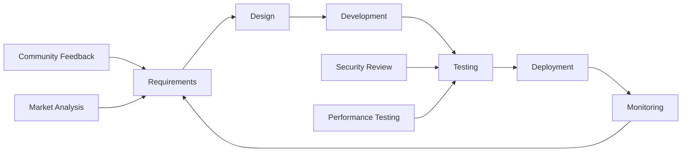

# Implementation Roadmap: NUAH Soft Peg 1:1 System

**Document Type**: Implementation Roadmap  
**Project**: NUAH Token Soft Peg Strategy  
**Version**: 1.0  
**Date**: January 2025  
**Status**: Draft

## Document Control

| Field | Value |
|-------|-------|
| **Document ID** | IR-NUAH-SOFTPEG-001 |
| **Classification** | Implementation Roadmap |
| **Dependencies** | Technical Specification, Requirements Specification |
| **Timeline** | Q1 2025 - Q4 2025 |
| **Budget Estimate** | $150,000 - $200,000 |

---

## 1. Executive Summary

### 1.1 Project Overview

This roadmap outlines the phased implementation of the NUAH Soft Peg 1:1 System, a community-driven price stability mechanism. The project will be delivered in four phases over 12 months, with each phase building upon the previous to create a comprehensive ecosystem supporting the 1:1 USD peg through community trust and transparency.

### 1.2 Strategic Objectives

- **Phase 1**: Establish basic monitoring and community interface (Q1 2025)
- **Phase 2**: Implement advanced analytics and alerting (Q2 2025)
- **Phase 3**: Deploy comprehensive community engagement tools (Q3 2025)
- **Phase 4**: Optimize and scale for long-term sustainability (Q4 2025)

### 1.3 Success Metrics

```yaml
Key Performance Indicators:
  Technical:
    - System uptime: >99.5%
    - API response time: <2 seconds
    - Price accuracy: >99.9%
    - Zero critical security incidents
  
  Business:
    - Community engagement: >1000 active users
    - Price stability: ±5% deviation <20% of time
    - Trust index: >70%
    - Cost efficiency: <$15k/month operational
  
  Community:
    - User satisfaction: >4.0/5.0
    - Feedback response rate: >20%
    - Educational content engagement: >500 views/week
    - Social media sentiment: >60% positive
```

---

## 2. Implementation Strategy

### 2.1 Development Methodology

**Approach**: Agile Development with DevOps Integration



**Sprint Structure**:
- **Sprint Duration**: 2 weeks
- **Team Size**: 5-7 developers + 2 DevOps + 1 PM
- **Release Cycle**: Monthly releases with hotfixes as needed
- **Review Cycle**: Weekly stakeholder reviews, monthly community updates

### 2.2 Risk Management Strategy

```yaml
Risk Mitigation Approach:
  Technical Risks:
    - Prototype early and test frequently
    - Implement comprehensive monitoring from day 1
    - Use proven technologies and patterns
    - Maintain 90%+ test coverage
  
  Business Risks:
    - Regular community engagement and feedback
    - Transparent communication about progress
    - Flexible architecture for future enhancements
    - Conservative timeline estimates with buffers
  
  Market Risks:
    - Monitor competitor solutions
    - Adapt to regulatory changes
    - Maintain cost flexibility
    - Build modular, extensible system
```

### 2.3 Quality Assurance Framework

```typescript
// Quality Gates for Each Phase
interface QualityGate {
  phase: string;
  criteria: {
    codeQuality: {
      coverage: number;        // Minimum test coverage %
      complexity: number;      // Maximum cyclomatic complexity
      duplication: number;     // Maximum code duplication %
      maintainability: string; // SonarQube rating
    };
    performance: {
      responseTime: number;    // 95th percentile in ms
      throughput: number;      // Requests per second
      availability: number;    // Uptime percentage
      errorRate: number;       // Maximum error rate %
    };
    security: {
      vulnerabilities: number; // Maximum high/critical vulns
      compliance: string[];    // Required compliance standards
      penetrationTest: boolean;// Pen test completion
    };
    usability: {
      satisfaction: number;    // User satisfaction score
      taskCompletion: number;  // Task completion rate %
      accessibility: string;   // WCAG compliance level
    };
  };
}

const qualityGates: QualityGate[] = [
  {
    phase: "Phase 1 - MVP",
    criteria: {
      codeQuality: { coverage: 80, complexity: 10, duplication: 3, maintainability: "B" },
      performance: { responseTime: 3000, throughput: 100, availability: 99.0, errorRate: 1 },
      security: { vulnerabilities: 0, compliance: ["OWASP Top 10"], penetrationTest: false },
      usability: { satisfaction: 3.5, taskCompletion: 80, accessibility: "AA" }
    }
  },
  {
    phase: "Phase 4 - Production",
    criteria: {
      codeQuality: { coverage: 90, complexity: 8, duplication: 2, maintainability: "A" },
      performance: { responseTime: 2000, throughput: 1000, availability: 99.5, errorRate: 0.1 },
      security: { vulnerabilities: 0, compliance: ["OWASP Top 10", "SOC 2"], penetrationTest: true },
      usability: { satisfaction: 4.0, taskCompletion: 90, accessibility: "AA" }
    }
  }
];
```

---

## 3. Phase 1: Foundation & MVP (Q1 2025)

### 3.1 Phase Overview

**Duration**: 12 weeks (January - March 2025)  
**Budget**: $40,000 - $50,000  
**Team**: 4 developers, 1 DevOps, 1 PM

**Objective**: Establish core price monitoring system and basic community interface to demonstrate soft peg concept and gather initial community feedback.

### 3.2 Sprint Breakdown

#### Sprint 1-2: Infrastructure & Core Services (Weeks 1-4)

```yaml
Sprint 1 (Weeks 1-2):
  Goals:
    - Set up development environment
    - Implement basic price aggregation service
    - Create database schema
    - Set up CI/CD pipeline
  
  Deliverables:
    - Development environment configured
    - Price aggregation service (Osmosis integration)
    - PostgreSQL database with initial schema
    - Basic CI/CD pipeline with automated testing
    - Docker containerization
  
  Acceptance Criteria:
    - Price data collected from Osmosis every 30 seconds
    - Data stored in database with proper indexing
    - Automated tests running on each commit
    - Local development environment reproducible

Sprint 2 (Weeks 3-4):
  Goals:
    - Implement deviation calculation logic
    - Add external price oracle integration
    - Create basic API endpoints
    - Set up monitoring infrastructure
  
  Deliverables:
    - Deviation calculation service
    - CoinGecko API integration
    - REST API with price endpoints
    - Prometheus monitoring setup
    - Basic alerting system
  
  Acceptance Criteria:
    - Price deviation calculated accurately
    - Multiple price sources aggregated
    - API endpoints responding within 2 seconds
    - Basic metrics collected and displayed
```

#### Sprint 3-4: Community Interface (Weeks 5-8)

```yaml
Sprint 3 (Weeks 5-6):
  Goals:
    - Develop React-based dashboard
    - Implement real-time price display
    - Create responsive design
    - Add basic charting functionality
  
  Deliverables:
    - React application with Vite build system
    - Real-time price dashboard
    - Mobile-responsive design
    - Historical price charts (Chart.js)
    - WebSocket integration for live updates
  
  Acceptance Criteria:
    - Dashboard loads within 3 seconds
    - Price updates every 30 seconds
    - Charts display 24h price history
    - Mobile experience fully functional

Sprint 4 (Weeks 7-8):
  Goals:
    - Implement community feedback system
    - Add educational content pages
    - Create alert notification system
    - Perform initial user testing
  
  Deliverables:
    - Feedback submission form
    - Educational content management
    - Discord webhook integration
    - User testing results and improvements
  
  Acceptance Criteria:
    - Users can submit feedback anonymously
    - Educational content accessible and helpful
    - Alerts posted to Discord automatically
    - User testing shows >80% task completion
```

#### Sprint 5-6: Testing & Deployment (Weeks 9-12)

```yaml
Sprint 5 (Weeks 9-10):
  Goals:
    - Comprehensive testing implementation
    - Performance optimization
    - Security hardening
    - Documentation completion
  
  Deliverables:
    - Complete test suite (unit, integration, e2e)
    - Performance benchmarks and optimizations
    - Security audit and fixes
    - User and developer documentation
  
  Acceptance Criteria:
    - Test coverage >80%
    - Performance targets met
    - Security vulnerabilities addressed
    - Documentation complete and accurate

Sprint 6 (Weeks 11-12):
  Goals:
    - Production deployment
    - Community launch
    - Monitoring and alerting validation
    - Initial feedback collection
  
  Deliverables:
    - Production environment deployed
    - Community announcement and onboarding
    - Monitoring dashboards active
    - Initial user feedback analysis
  
  Acceptance Criteria:
    - System running stably in production
    - Community actively using the platform
    - All monitoring and alerts functional
    - Positive initial feedback received
```

### 3.3 Phase 1 Deliverables

```yaml
Technical Deliverables:
  Backend Services:
    - Price aggregation service (Osmosis + CoinGecko)
    - Deviation calculation engine
    - REST API with core endpoints
    - PostgreSQL database with optimized schema
    - Basic alerting system
  
  Frontend Application:
    - React dashboard with real-time updates
    - Mobile-responsive design
    - Historical price charts
    - Community feedback form
    - Educational content pages
  
  Infrastructure:
    - Docker containerization
    - CI/CD pipeline with automated testing
    - Prometheus monitoring
    - Production deployment on cloud platform
  
  Documentation:
    - User guide for community dashboard
    - API documentation
    - Deployment and maintenance guides
    - Initial community onboarding materials

Business Deliverables:
  - Functional MVP demonstrating soft peg concept
  - Initial community engagement metrics
  - Baseline performance and reliability data
  - User feedback and improvement recommendations
```

### 3.4 Phase 1 Success Criteria

```yaml
Technical Success:
  - System uptime >99% during first month
  - API response times <3 seconds (95th percentile)
  - Price data accuracy >99.5%
  - Zero critical security vulnerabilities
  - Test coverage >80%

Business Success:
  - >100 active community users
  - >50 feedback submissions
  - Price deviation alerts working correctly
  - Positive community sentiment (>60%)
  - Operational costs <$5k/month

User Success:
  - User satisfaction >3.5/5.0
  - Task completion rate >80%
  - Mobile usage >30% of total traffic
  - Educational content engagement >100 views/week
```

---

## 4. Phase 2: Analytics & Intelligence (Q2 2025)

### 4.1 Phase Overview

**Duration**: 12 weeks (April - June 2025)  
**Budget**: $45,000 - $55,000  
**Team**: 5 developers, 2 DevOps, 1 PM, 1 Data Analyst

**Objective**: Enhance the system with advanced analytics, predictive capabilities, and comprehensive monitoring to provide deeper insights into price stability and community behavior.

### 4.2 Key Features

#### Advanced Analytics Engine

```python
# analytics_engine.py
class AdvancedAnalytics:
    def __init__(self):
        self.price_predictor = PricePredictor()
        self.sentiment_analyzer = SentimentAnalyzer()
        self.market_analyzer = MarketAnalyzer()
        self.community_analyzer = CommunityAnalyzer()
    
    def generate_stability_report(self, timeframe: str) -> StabilityReport:
        """Generate comprehensive stability analysis"""
        return StabilityReport(
            price_volatility=self.calculate_volatility(timeframe),
            deviation_patterns=self.analyze_deviation_patterns(timeframe),
            community_confidence=self.sentiment_analyzer.get_confidence_score(),
            market_conditions=self.market_analyzer.get_market_state(),
            predictions=self.price_predictor.forecast(24)  # 24-hour forecast
        )
    
    def detect_anomalies(self, data: PriceData) -> List[Anomaly]:
        """Detect unusual price movements or patterns"""
        anomalies = []
        
        # Statistical anomaly detection
        if self.is_statistical_outlier(data):
            anomalies.append(Anomaly(type="statistical", severity="medium"))
        
        # Pattern-based anomaly detection
        if self.detect_manipulation_pattern(data):
            anomalies.append(Anomaly(type="manipulation", severity="high"))
        
        # Volume anomaly detection
        if self.is_volume_anomaly(data):
            anomalies.append(Anomaly(type="volume", severity="low"))
        
        return anomalies
```

#### Predictive Modeling

```python
# predictive_models.py
from sklearn.ensemble import RandomForestRegressor
from sklearn.preprocessing import StandardScaler
import numpy as np

class PricePredictionModel:
    def __init__(self):
        self.model = RandomForestRegressor(n_estimators=100, random_state=42)
        self.scaler = StandardScaler()
        self.feature_columns = [
            'price_ma_1h', 'price_ma_24h', 'volume_ma_24h',
            'deviation_trend', 'community_sentiment', 'market_volatility'
        ]
    
    def prepare_features(self, data: pd.DataFrame) -> np.ndarray:
        """Prepare features for prediction"""
        features = data[self.feature_columns].copy()
        
        # Add technical indicators
        features['rsi'] = self.calculate_rsi(data['price'])
        features['bollinger_position'] = self.calculate_bollinger_position(data['price'])
        features['volume_ratio'] = data['volume'] / data['volume'].rolling(24).mean()
        
        return self.scaler.fit_transform(features)
    
    def predict_price_movement(self, current_data: pd.DataFrame, hours_ahead: int = 1) -> PredictionResult:
        """Predict price movement for specified hours ahead"""
        features = self.prepare_features(current_data)
        
        # Predict price change probability
        price_change_prob = self.model.predict_proba(features)[-1]
        
        # Calculate confidence intervals
        predictions = []
        for _ in range(100):  # Bootstrap predictions
            pred = self.model.predict(features)[-1]
            predictions.append(pred)
        
        return PredictionResult(
            predicted_price=np.mean(predictions),
            confidence_interval=(np.percentile(predictions, 5), np.percentile(predictions, 95)),
            probability_increase=price_change_prob[1],
            model_confidence=self.calculate_model_confidence(features)
        )
```

### 4.3 Sprint Breakdown

#### Sprint 7-8: Analytics Infrastructure (Weeks 13-16)

```yaml
Sprint 7 (Weeks 13-14):
  Goals:
    - Implement data warehouse architecture
    - Create ETL pipelines for historical data
    - Set up analytics database
    - Develop basic statistical analysis tools
  
  Deliverables:
    - ClickHouse analytics database
    - ETL pipelines using Apache Airflow
    - Historical data migration (6+ months)
    - Basic statistical analysis API
  
  Acceptance Criteria:
    - Analytics database processing >10k records/second
    - ETL pipelines running reliably every hour
    - Historical data integrity verified
    - Statistical calculations accurate

Sprint 8 (Weeks 15-16):
  Goals:
    - Implement anomaly detection algorithms
    - Create predictive modeling framework
    - Develop market sentiment analysis
    - Add advanced charting capabilities
  
  Deliverables:
    - Anomaly detection service
    - Machine learning model training pipeline
    - Sentiment analysis integration
    - Advanced charts with technical indicators
  
  Acceptance Criteria:
    - Anomaly detection accuracy >85%
    - Predictive models showing reasonable accuracy
    - Sentiment scores correlating with market data
    - Charts loading within 2 seconds
```

#### Sprint 9-10: Intelligence Features (Weeks 17-20)

```yaml
Sprint 9 (Weeks 17-18):
  Goals:
    - Develop stability scoring algorithm
    - Implement trend analysis tools
    - Create automated reporting system
    - Add community behavior analytics
  
  Deliverables:
    - Stability score calculation engine
    - Trend analysis dashboard
    - Automated daily/weekly reports
    - Community engagement analytics
  
  Acceptance Criteria:
    - Stability scores accurately reflect market conditions
    - Trend analysis provides actionable insights
    - Reports generated and distributed automatically
    - Community analytics showing user behavior patterns

Sprint 10 (Weeks 19-20):
  Goals:
    - Implement intelligent alerting system
    - Create market condition classifier
    - Develop risk assessment tools
    - Add comparative analysis features
  
  Deliverables:
    - Smart alerting with ML-based filtering
    - Market condition classification
    - Risk dashboard and metrics
    - Comparative analysis with other stablecoins
  
  Acceptance Criteria:
    - Alert false positive rate <5%
    - Market conditions classified accurately
    - Risk metrics providing early warning
    - Comparative analysis showing meaningful insights
```

#### Sprint 11-12: Integration & Optimization (Weeks 21-24)

```yaml
Sprint 11 (Weeks 21-22):
  Goals:
    - Integrate all analytics features
    - Optimize performance for real-time processing
    - Implement caching strategies
    - Create analytics API documentation
  
  Deliverables:
    - Unified analytics dashboard
    - Performance optimizations
    - Redis caching layer
    - Comprehensive API documentation
  
  Acceptance Criteria:
    - Analytics dashboard loading <2 seconds
    - Real-time processing handling 1000+ events/second
    - Cache hit rate >80%
    - API documentation complete and accurate

Sprint 12 (Weeks 23-24):
  Goals:
    - User testing and feedback integration
    - Performance tuning and optimization
    - Security audit and hardening
    - Phase 2 deployment and launch
  
  Deliverables:
    - User testing results and improvements
    - Performance benchmarks
    - Security audit report
    - Production deployment of Phase 2 features
  
  Acceptance Criteria:
    - User satisfaction >4.0/5.0
    - Performance targets exceeded
    - Security vulnerabilities addressed
    - All Phase 2 features live and functional
```

### 4.4 Phase 2 Success Criteria

```yaml
Technical Success:
  - Analytics processing >10k events/second
  - Predictive model accuracy >70%
  - Anomaly detection precision >85%
  - System uptime >99.5%
  - API response times <2 seconds

Business Success:
  - >500 active community users
  - Stability score correlating with market conditions
  - Reduced false alert rate by 50%
  - Increased community engagement by 100%
  - Operational costs <$8k/month

User Success:
  - User satisfaction >4.0/5.0
  - Analytics features used by >60% of users
  - Educational content engagement doubled
  - Community feedback quality improved
```

---

## 5. Phase 3: Community Ecosystem (Q3 2025)

### 5.1 Phase Overview

**Duration**: 12 weeks (July - September 2025)  
**Budget**: $50,000 - $65,000  
**Team**: 6 developers, 2 DevOps, 1 PM, 1 Community Manager, 1 UX Designer

**Objective**: Build comprehensive community engagement tools, governance features, and educational ecosystem to strengthen community trust and participation in the soft peg mechanism.

### 5.2 Key Features

#### Community Governance System

```solidity
// CommunityGovernance.sol
pragma solidity ^0.8.19;

contract CommunityGovernance {
    struct Proposal {
        uint256 id;
        string title;
        string description;
        ProposalType proposalType;
        uint256 votingStart;
        uint256 votingEnd;
        uint256 votesFor;
        uint256 votesAgainst;
        bool executed;
        mapping(address => bool) hasVoted;
    }
    
    enum ProposalType {
        PARAMETER_CHANGE,
        FEATURE_REQUEST,
        COMMUNITY_INITIATIVE,
        EMERGENCY_ACTION
    }
    
    mapping(uint256 => Proposal) public proposals;
    mapping(address => uint256) public votingPower;
    
    event ProposalCreated(uint256 indexed proposalId, string title, ProposalType proposalType);
    event VoteCast(uint256 indexed proposalId, address indexed voter, bool support, uint256 weight);
    event ProposalExecuted(uint256 indexed proposalId);
    
    function createProposal(
        string memory title,
        string memory description,
        ProposalType proposalType,
        uint256 votingDuration
    ) external returns (uint256) {
        require(votingPower[msg.sender] >= MIN_PROPOSAL_THRESHOLD, "Insufficient voting power");
        
        uint256 proposalId = nextProposalId++;
        Proposal storage proposal = proposals[proposalId];
        
        proposal.id = proposalId;
        proposal.title = title;
        proposal.description = description;
        proposal.proposalType = proposalType;
        proposal.votingStart = block.timestamp;
        proposal.votingEnd = block.timestamp + votingDuration;
        
        emit ProposalCreated(proposalId, title, proposalType);
        return proposalId;
    }
    
    function vote(uint256 proposalId, bool support) external {
        Proposal storage proposal = proposals[proposalId];
        require(block.timestamp >= proposal.votingStart, "Voting not started");
        require(block.timestamp <= proposal.votingEnd, "Voting ended");
        require(!proposal.hasVoted[msg.sender], "Already voted");
        
        uint256 weight = votingPower[msg.sender];
        require(weight > 0, "No voting power");
        
        proposal.hasVoted[msg.sender] = true;
        
        if (support) {
            proposal.votesFor += weight;
        } else {
            proposal.votesAgainst += weight;
        }
        
        emit VoteCast(proposalId, msg.sender, support, weight);
    }
}
```

#### Educational Content Management

```typescript
// education-system.ts
interface EducationalContent {
  id: string;
  title: string;
  type: 'article' | 'video' | 'interactive' | 'quiz';
  difficulty: 'beginner' | 'intermediate' | 'advanced';
  topics: string[];
  content: string;
  estimatedReadTime: number;
  prerequisites: string[];
  learningObjectives: string[];
  createdAt: Date;
  updatedAt: Date;
  author: string;
  reviewStatus: 'draft' | 'review' | 'approved' | 'published';
  engagement: {
    views: number;
    likes: number;
    shares: number;
    completions: number;
    averageRating: number;
  };
}

class EducationSystem {
  private contentRepository: ContentRepository;
  private progressTracker: ProgressTracker;
  private recommendationEngine: RecommendationEngine;
  
  async createLearningPath(userId: string, goals: string[]): Promise<LearningPath> {
    const userProfile = await this.getUserProfile(userId);
    const recommendedContent = await this.recommendationEngine.generatePath(
      userProfile,
      goals
    );
    
    return {
      id: generateId(),
      userId,
      title: `Personalized Learning Path: ${goals.join(', ')}`,
      content: recommendedContent,
      estimatedDuration: this.calculateDuration(recommendedContent),
      progress: 0,
      createdAt: new Date()
    };
  }
  
  async trackProgress(userId: string, contentId: string, progress: number): Promise<void> {
    await this.progressTracker.updateProgress(userId, contentId, progress);
    
    // Award achievements
    const achievements = await this.checkAchievements(userId);
    if (achievements.length > 0) {
      await this.awardAchievements(userId, achievements);
    }
    
    // Update recommendations
    await this.recommendationEngine.updateUserProfile(userId, contentId, progress);
  }
  
  async generateQuiz(contentId: string): Promise<Quiz> {
    const content = await this.contentRepository.getById(contentId);
    const questions = await this.generateQuestionsFromContent(content);
    
    return {
      id: generateId(),
      contentId,
      title: `Quiz: ${content.title}`,
      questions,
      timeLimit: 300, // 5 minutes
      passingScore: 80
    };
  }
}
```

### 5.3 Sprint Breakdown

#### Sprint 13-14: Community Platform Foundation (Weeks 25-28)

```yaml
Sprint 13 (Weeks 25-26):
  Goals:
    - Develop community forum system
    - Implement user authentication and profiles
    - Create reputation and achievement system
    - Set up community moderation tools
  
  Deliverables:
    - Forum with threaded discussions
    - User registration and profile management
    - Reputation scoring algorithm
    - Moderation dashboard and tools
  
  Acceptance Criteria:
    - Users can create accounts and participate in discussions
    - Reputation system accurately reflects contributions
    - Moderation tools effectively manage content
    - Forum performance supports 1000+ concurrent users

Sprint 14 (Weeks 27-28):
  Goals:
    - Implement governance proposal system
    - Create voting mechanisms
    - Develop proposal lifecycle management
    - Add governance analytics
  
  Deliverables:
    - Proposal creation and submission system
    - Voting interface with multiple voting methods
    - Proposal status tracking and notifications
    - Governance participation analytics
  
  Acceptance Criteria:
    - Community can create and vote on proposals
    - Voting results calculated accurately
    - Proposal lifecycle properly managed
    - Governance metrics tracked and displayed
```

#### Sprint 15-16: Educational Ecosystem (Weeks 29-32)

```yaml
Sprint 15 (Weeks 29-30):
  Goals:
    - Build educational content management system
    - Create interactive learning modules
    - Implement progress tracking
    - Develop content recommendation engine
  
  Deliverables:
    - CMS for educational content
    - Interactive tutorials and quizzes
    - User progress tracking system
    - Personalized content recommendations
  
  Acceptance Criteria:
    - Content creators can easily publish materials
    - Users can complete interactive learning modules
    - Progress accurately tracked and displayed
    - Recommendations improve user engagement

Sprint 16 (Weeks 31-32):
  Goals:
    - Create gamification features
    - Implement achievement and badge system
    - Develop leaderboards and competitions
    - Add social learning features
  
  Deliverables:
    - Achievement and badge system
    - Community leaderboards
    - Learning competitions and challenges
    - Social features (study groups, peer reviews)
  
  Acceptance Criteria:
    - Gamification increases user engagement by 50%
    - Achievement system motivates continued learning
    - Competitions generate community excitement
    - Social features foster collaboration
```

#### Sprint 17-18: Advanced Community Features (Weeks 33-36)

```yaml
Sprint 17 (Weeks 33-34):
  Goals:
    - Implement community-driven content creation
    - Create peer review and validation system
    - Develop community contribution rewards
    - Add advanced search and discovery
  
  Deliverables:
    - User-generated content system
    - Peer review workflow
    - Contribution reward mechanism
    - Advanced search with filters and tags
  
  Acceptance Criteria:
    - Community actively creates quality content
    - Peer review ensures content accuracy
    - Contributors feel valued and rewarded
    - Search helps users find relevant information

Sprint 18 (Weeks 35-36):
  Goals:
    - Launch community ambassador program
    - Implement multi-language support
    - Create community events and webinar system
    - Add mobile app for community engagement
  
  Deliverables:
    - Ambassador program management tools
    - Multi-language content and interface
    - Event scheduling and webinar integration
    - Mobile app (React Native)
  
  Acceptance Criteria:
    - Ambassador program actively managed
    - Platform accessible in multiple languages
    - Community events well-attended
    - Mobile app provides full functionality
```

### 5.4 Phase 3 Success Criteria

```yaml
Technical Success:
  - Community platform supporting 2000+ concurrent users
  - Mobile app with >4.0 app store rating
  - Multi-language support for 5+ languages
  - System uptime >99.5%
  - Educational content engagement >80%

Business Success:
  - >1000 active community members
  - >100 governance proposals submitted
  - >500 pieces of user-generated content
  - Community satisfaction >4.2/5.0
  - Operational costs <$12k/month

Community Success:
  - Active daily discussions in forum
  - High-quality educational content library
  - Strong community governance participation
  - Positive sentiment in external communities
  - Growing ambassador program
```

---

## 6. Phase 4: Optimization & Scale (Q4 2025)

### 6.1 Phase Overview

**Duration**: 12 weeks (October - December 2025)  
**Budget**: $55,000 - $70,000  
**Team**: 7 developers, 3 DevOps, 1 PM, 1 Community Manager, 1 Data Scientist

**Objective**: Optimize system performance, implement advanced features, prepare for scale, and establish long-term sustainability mechanisms.

### 6.2 Key Features

#### Advanced Market Making Support

```python
# market_making_support.py
class MarketMakingSupport:
    def __init__(self):
        self.price_oracle = PriceOracle()
        self.liquidity_analyzer = LiquidityAnalyzer()
        self.market_maker_registry = MarketMakerRegistry()
        self.incentive_calculator = IncentiveCalculator()
    
    async def calculate_optimal_spreads(self, pool_id: str) -> SpreadRecommendation:
        """Calculate optimal bid-ask spreads for market makers"""
        pool_data = await self.get_pool_data(pool_id)
        market_conditions = await self.analyze_market_conditions()
        
        # Calculate base spread based on volatility
        volatility = self.calculate_volatility(pool_data.price_history)
        base_spread = max(0.001, volatility * 0.5)  # Minimum 0.1% spread
        
        # Adjust for liquidity depth
        liquidity_adjustment = self.calculate_liquidity_adjustment(pool_data.liquidity)
        
        # Adjust for market conditions
        market_adjustment = self.calculate_market_adjustment(market_conditions)
        
        optimal_spread = base_spread * liquidity_adjustment * market_adjustment
        
        return SpreadRecommendation(
            bid_spread=optimal_spread,
            ask_spread=optimal_spread,
            confidence=self.calculate_confidence(pool_data, market_conditions),
            update_frequency=self.recommend_update_frequency(volatility)
        )
    
    async def provide_market_maker_incentives(self, maker_address: str) -> IncentivePackage:
        """Calculate incentives for market makers based on performance"""
        performance = await self.analyze_maker_performance(maker_address)
        
        # Base incentive calculation
        volume_incentive = performance.volume_provided * 0.0001  # 0.01% of volume
        uptime_incentive = performance.uptime_percentage * 100  # Bonus for high uptime
        spread_quality_incentive = self.calculate_spread_quality_bonus(performance)
        
        total_incentive = volume_incentive + uptime_incentive + spread_quality_incentive
        
        return IncentivePackage(
            total_amount=total_incentive,
            breakdown={
                'volume': volume_incentive,
                'uptime': uptime_incentive,
                'spread_quality': spread_quality_incentive
            },
            payment_schedule='weekly',
            performance_metrics=performance
        )
```

#### Automated Stability Mechanisms

```typescript
// stability-mechanisms.ts
class AutomatedStabilityMechanisms {
  private priceMonitor: PriceMonitor;
  private liquidityManager: LiquidityManager;
  private communityNotifier: CommunityNotifier;
  private emergencyProtocols: EmergencyProtocols;
  
  async monitorAndRespond(): Promise<void> {
    const currentState = await this.assessCurrentState();
    
    switch (currentState.stabilityLevel) {
      case 'STABLE':
        await this.maintainNormalOperations();
        break;
        
      case 'MINOR_DEVIATION':
        await this.activateMinorStabilization(currentState);
        break;
        
      case 'MAJOR_DEVIATION':
        await this.activateMajorStabilization(currentState);
        break;
        
      case 'CRITICAL':
        await this.activateEmergencyProtocols(currentState);
        break;
    }
  }
  
  private async activateMinorStabilization(state: MarketState): Promise<void> {
    // Increase market maker incentives
    await this.liquidityManager.boostIncentives(1.2);
    
    // Send community notifications
    await this.communityNotifier.sendDeviationAlert({
      severity: 'minor',
      currentPrice: state.price,
      deviation: state.deviation,
      recommendedActions: [
        'Monitor price movements',
        'Consider providing liquidity',
        'Stay informed through community channels'
      ]
    });
    
    // Increase monitoring frequency
    await this.priceMonitor.setUpdateFrequency(15); // 15-second updates
  }
  
  private async activateMajorStabilization(state: MarketState): Promise<void> {
    // Significantly boost market maker incentives
    await this.liquidityManager.boostIncentives(2.0);
    
    // Activate community response protocols
    await this.communityNotifier.activateEmergencyChannel();
    
    // Request community governance input
    await this.requestCommunityGuidance(state);
    
    // Increase monitoring to real-time
    await this.priceMonitor.setUpdateFrequency(5); // 5-second updates
  }
  
  private async activateEmergencyProtocols(state: MarketState): Promise<void> {
    // Implement emergency measures
    await this.emergencyProtocols.activate({
      pauseNonEssentialFeatures: true,
      maxIncentiveBoost: 5.0,
      emergencyCommunityMeeting: true,
      externalExpertConsultation: true
    });
    
    // Notify all stakeholders immediately
    await this.communityNotifier.sendEmergencyAlert(state);
  }
}
```

### 6.3 Sprint Breakdown

#### Sprint 19-20: Performance Optimization (Weeks 37-40)

```yaml
Sprint 19 (Weeks 37-38):
  Goals:
    - Implement advanced caching strategies
    - Optimize database queries and indexing
    - Add CDN for global content delivery
    - Implement horizontal scaling
  
  Deliverables:
    - Multi-layer caching system (Redis, CDN)
    - Database query optimization (95% queries <100ms)
    - Global CDN deployment
    - Auto-scaling infrastructure
  
  Acceptance Criteria:
    - Page load times reduced by 50%
    - Database performance improved by 3x
    - Global users experience <2s load times
    - System auto-scales based on demand

Sprint 20 (Weeks 39-40):
  Goals:
    - Implement advanced monitoring and observability
    - Create predictive scaling algorithms
    - Optimize mobile app performance
    - Add offline functionality
  
  Deliverables:
    - Comprehensive observability stack
    - Predictive scaling based on usage patterns
    - Mobile app performance optimizations
    - Offline-first mobile experience
  
  Acceptance Criteria:
    - Full system observability with <1min MTTD
    - Predictive scaling reduces costs by 30%
    - Mobile app performance improved by 40%
    - Offline functionality works seamlessly
```

#### Sprint 21-22: Advanced Features (Weeks 41-44)

```yaml
Sprint 21 (Weeks 41-42):
  Goals:
    - Implement market making support tools
    - Create automated stability mechanisms
    - Add advanced analytics and ML models
    - Develop API for third-party integrations
  
  Deliverables:
    - Market maker dashboard and tools
    - Automated stability response system
    - Advanced ML models for prediction
    - Public API with comprehensive documentation
  
  Acceptance Criteria:
    - Market makers actively using support tools
    - Stability mechanisms respond within 1 minute
    - ML models show >75% accuracy
    - API adoption by 3+ third-party services

Sprint 22 (Weeks 43-44):
  Goals:
    - Launch institutional features
    - Implement advanced security measures
    - Create compliance and reporting tools
    - Add enterprise-grade monitoring
  
  Deliverables:
    - Institutional dashboard and features
    - Advanced security (MFA, SSO, audit logs)
    - Compliance reporting automation
    - Enterprise monitoring and SLA tracking
  
  Acceptance Criteria:
    - Institutional users onboarded successfully
    - Security audit passes with zero findings
    - Compliance reports generated automatically
    - SLA tracking shows >99.9% uptime
```

#### Sprint 23-24: Sustainability & Future-Proofing (Weeks 45-48)

```yaml
Sprint 23 (Weeks 45-46):
  Goals:
    - Implement revenue generation mechanisms
    - Create long-term sustainability plan
    - Add advanced governance features
    - Prepare for algorithmic peg transition
  
  Deliverables:
    - Revenue model implementation
    - Sustainability roadmap and metrics
    - Advanced governance (delegation, committees)
    - Algorithmic peg preparation framework
  
  Acceptance Criteria:
    - Revenue streams covering 80% of operational costs
    - Sustainability metrics trending positive
    - Governance participation increased by 200%
    - Framework ready for algorithmic transition

Sprint 24 (Weeks 47-48):
  Goals:
    - Complete comprehensive testing
    - Finalize documentation and training
    - Launch celebration and community event
    - Plan 2026 roadmap
  
  Deliverables:
    - Complete test suite with >95% coverage
    - Comprehensive documentation library
    - Community celebration event
    - 2026 strategic roadmap
  
  Acceptance Criteria:
    - All systems tested and validated
    - Documentation complete and accessible
    - Community celebration successful
    - 2026 roadmap approved by stakeholders
```

### 6.4 Phase 4 Success Criteria

```yaml
Technical Success:
  - System supporting 10,000+ concurrent users
  - 99.9% uptime achieved consistently
  - Sub-second response times globally
  - Zero critical security incidents
  - ML models achieving >75% accuracy

Business Success:
  - Revenue covering 80%+ of operational costs
  - >2000 active community members
  - Institutional adoption achieved
  - Market maker ecosystem thriving
  - Sustainability metrics positive

Community Success:
  - Strong community governance participation
  - High-quality educational ecosystem
  - Positive external reputation
  - Successful transition planning
  - Community-driven innovation
```

---

## 7. Resource Planning

### 7.1 Team Structure

```yaml
Core Team Composition:
  Leadership:
    - Project Manager (1.0 FTE)
    - Technical Lead (1.0 FTE)
    - Community Manager (0.5 FTE → 1.0 FTE in Phase 3)
  
  Development:
    - Senior Full-Stack Developers (2.0 FTE)
    - Frontend Developers (1.0 FTE → 2.0 FTE in Phase 2)
    - Backend Developers (1.0 FTE → 2.0 FTE in Phase 2)
    - Mobile Developer (0.0 FTE → 1.0 FTE in Phase 3)
  
  Infrastructure & Operations:
    - DevOps Engineers (1.0 FTE → 3.0 FTE in Phase 4)
    - Security Engineer (0.5 FTE → 1.0 FTE in Phase 2)
  
  Specialized Roles:
    - Data Scientist/ML Engineer (0.0 FTE → 1.0 FTE in Phase 2)
    - UX/UI Designer (0.5 FTE → 1.0 FTE in Phase 3)
    - Technical Writer (0.25 FTE → 0.5 FTE in Phase 3)

External Resources:
  - Security Audit Firm (Quarterly)
  - Legal Counsel (As needed)
  - Marketing Agency (Phase 3-4)
  - Community Moderators (Volunteer → Paid in Phase 3)
```

### 7.2 Budget Breakdown

```yaml
Total Project Budget: $190,000 - $240,000

Phase 1 (Q1 2025): $40,000 - $50,000
  Personnel (80%): $32,000 - $40,000
  Infrastructure (15%): $6,000 - $7,500
  Tools & Services (5%): $2,000 - $2,500

Phase 2 (Q2 2025): $45,000 - $55,000
  Personnel (75%): $33,750 - $41,250
  Infrastructure (20%): $9,000 - $11,000
  Tools & Services (5%): $2,250 - $2,750

Phase 3 (Q3 2025): $50,000 - $65,000
  Personnel (70%): $35,000 - $45,500
  Infrastructure (20%): $10,000 - $13,000
  Marketing & Community (10%): $5,000 - $6,500

Phase 4 (Q4 2025): $55,000 - $70,000
  Personnel (65%): $35,750 - $45,500
  Infrastructure (25%): $13,750 - $17,500
  Marketing & Growth (10%): $5,500 - $7,000

Ongoing Operational Costs (2026+):
  Monthly: $12,000 - $15,000
  Annual: $144,000 - $180,000
```

### 7.3 Infrastructure Costs

```yaml
Cloud Infrastructure (AWS/GCP):
  Phase 1: $500-800/month
    - 2x Application servers (t3.medium)
    - 1x Database server (db.t3.medium)
    - 1x Redis cache (cache.t3.micro)
    - Load balancer and CDN
  
  Phase 2: $1,200-1,800/month
    - 4x Application servers (t3.large)
    - 1x Database cluster (db.t3.large + read replica)
    - 2x Redis cache (cache.t3.small)
    - Analytics database (ClickHouse)
    - Enhanced monitoring
  
  Phase 3: $2,000-3,000/month
    - 6x Application servers (auto-scaling)
    - Database cluster with multi-AZ
    - Redis cluster
    - Mobile app backend
    - Global CDN
  
  Phase 4: $3,000-4,500/month
    - Auto-scaling infrastructure
    - Multi-region deployment
    - Advanced monitoring and logging
    - ML model serving infrastructure

Third-Party Services:
  - Monitoring (Datadog/New Relic): $200-500/month
  - Security scanning: $100-300/month
  - Email service: $50-100/month
  - SMS/Push notifications: $100-200/month
  - External APIs: $200-400/month
```

---

## 8. Risk Management

### 8.1 Technical Risks

```yaml
High-Impact Technical Risks:
  
  Risk: Scalability Bottlenecks
  Probability: Medium
  Impact: High
  Mitigation:
    - Early performance testing and optimization
    - Horizontal scaling architecture from Phase 1
    - Regular load testing and capacity planning
    - Cloud-native auto-scaling implementation
  
  Risk: Data Accuracy Issues
  Probability: Medium
  Impact: Critical
  Mitigation:
    - Multi-source price validation
    - Comprehensive data quality monitoring
    - Automated anomaly detection
    - Manual verification procedures
  
  Risk: Security Vulnerabilities
  Probability: Low
  Impact: Critical
  Mitigation:
    - Regular security audits and penetration testing
    - Secure coding practices and code reviews
    - Automated security scanning in CI/CD
    - Incident response procedures
  
  Risk: Third-Party API Dependencies
  Probability: High
  Impact: Medium
  Mitigation:
    - Multiple redundant data sources
    - Circuit breaker patterns
    - Graceful degradation mechanisms
    - SLA monitoring and alerting
```

### 8.2 Business Risks

```yaml
High-Impact Business Risks:
  
  Risk: Low Community Adoption
  Probability: Medium
  Impact: High
  Mitigation:
    - Early and continuous community engagement
    - User-centered design and testing
    - Comprehensive educational content
    - Community incentive programs
  
  Risk: Market Volatility Impact
  Probability: High
  Impact: Medium
  Mitigation:
    - Flexible peg tolerance mechanisms
    - Clear communication about soft peg nature
    - Community education about market dynamics
    - Preparation for algorithmic transition
  
  Risk: Regulatory Changes
  Probability: Medium
  Impact: Medium
  Mitigation:
    - Regular legal consultation
    - Compliance-first architecture
    - Flexible system design
    - Proactive regulatory monitoring
  
  Risk: Competitive Pressure
  Probability: Medium
  Impact: Medium
  Mitigation:
    - Unique community-focused value proposition
    - Continuous innovation and improvement
    - Strong community relationships
    - Open-source collaboration opportunities
```

### 8.3 Operational Risks

```yaml
Operational Risk Management:
  
  Risk: Key Personnel Departure
  Probability: Medium
  Impact: Medium
  Mitigation:
    - Comprehensive documentation
    - Knowledge sharing sessions
    - Cross-training team members
    - Competitive retention packages
  
  Risk: Budget Overruns
  Probability: Medium
  Impact: Medium
  Mitigation:
    - Conservative budget estimates with 20% buffer
    - Monthly budget reviews and adjustments
    - Phased delivery with go/no-go decisions
    - Cost optimization throughout development
  
  Risk: Timeline Delays
  Probability: Medium
  Impact: Medium
  Mitigation:
    - Realistic timeline estimates with buffers
    - Agile methodology with regular adjustments
    - Early identification of blockers
    - Scope flexibility for critical path items
```

---

## 9. Success Metrics & KPIs

### 9.1 Technical KPIs

```yaml
System Performance:
  - Uptime: >99.5% (target: 99.9%)
  - API Response Time: <2 seconds (95th percentile)
  - Page Load Time: <3 seconds (first visit)
  - Mobile App Performance: >4.0 app store rating
  - Database Query Performance: <500ms (95th percentile)

Data Quality:
  - Price Accuracy: >99.9%
  - Data Completeness: >99.5%
  - Alert False Positive Rate: <5%
  - Anomaly Detection Accuracy: >85%

Security & Compliance:
  - Critical Vulnerabilities: 0
  - Security Incident Response Time: <1 hour
  - Compliance Audit Score: >95%
  - Data Breach Incidents: 0

Scalability:
  - Concurrent Users Supported: 10,000+
  - Data Processing Rate: >10,000 events/second
  - Auto-scaling Response Time: <2 minutes
  - Cost per User: <$2/month
```

### 9.2 Business KPIs

```yaml
Community Growth:
  - Active Monthly Users: 2,000+ (target: 5,000+)
  - Daily Active Users: 500+ (target: 1,000+)
  - User Retention Rate: >60% (30-day)
  - Community Growth Rate: >20% monthly

Engagement Metrics:
  - Forum Posts per Day: >50
  - Educational Content Completion Rate: >70%
  - Governance Participation Rate: >30%
  - User-Generated Content: >100 pieces/month

Price Stability:
  - Time within ±5% of peg: >80%
  - Average Daily Deviation: <3%
  - Maximum Deviation Duration: <24 hours
  - Community Confidence Score: >70%

Revenue & Sustainability:
  - Monthly Recurring Revenue: $10,000+ (by Phase 4)
  - Cost Recovery Rate: >80%
  - Revenue Growth Rate: >15% monthly
  - Customer Acquisition Cost: <$50
```

### 9.3 Community KPIs

```yaml
Community Health:
  - User Satisfaction Score: >4.0/5.0
  - Net Promoter Score: >50
  - Community Sentiment: >60% positive
  - Support Ticket Resolution Time: <24 hours

Educational Impact:
  - Course Completion Rate: >70%
  - Knowledge Assessment Scores: >80%
  - Educational Content Engagement: >1000 views/week
  - Peer-to-Peer Learning Activities: >100/month

Governance Participation:
  - Proposal Submission Rate: >10/month
  - Voting Participation Rate: >40%
  - Governance Discussion Engagement: >200 comments/proposal
  - Community Decision Implementation Rate: >90%
```

---

## 10. Post-Launch Strategy

### 10.1 Continuous Improvement

```yaml
Ongoing Development Priorities:
  
  Q1 2026 - Algorithmic Transition Preparation:
    - Research and design algorithmic stability mechanisms
    - Community education about transition benefits
    - Gradual introduction of automated features
    - Governance framework for transition decisions
  
  Q2 2026 - Advanced Analytics & AI:
    - Enhanced predictive modeling
    - Automated market making optimization
    - Advanced risk assessment tools
    - Personalized user experiences
  
  Q3 2026 - Ecosystem Expansion:
    - Integration with additional DEXs
    - Cross-chain compatibility
    - Partnership with other stablecoin projects
    - Enterprise and institutional features
  
  Q4 2026 - Innovation & Research:
    - Novel stability mechanisms research
    - Community-driven feature development
    - Open-source ecosystem contributions
    - Academic partnerships and publications
```

### 10.2 Long-term Sustainability

```yaml
Sustainability Framework:
  
  Revenue Diversification:
    - Premium features for power users
    - API access fees for commercial users
    - Educational course certifications
    - Consulting services for other projects
  
  Community Ownership:
    - Gradual transition to DAO governance
    - Community-funded development grants
    - Volunteer contributor programs
    - Community-driven roadmap planning
  
  Technical Evolution:
    - Modular architecture for easy updates
    - Plugin system for community extensions
    - Open-source core with premium add-ons
    - Continuous technology stack modernization
  
  Ecosystem Integration:
    - Strategic partnerships with DeFi protocols
    - Integration with wallet providers
    - Collaboration with other Cosmos projects
    - Cross-chain expansion opportunities
```

---

## 11. Conclusion

This implementation roadmap provides a comprehensive path to building a successful NUAH Soft Peg 1:1 System. The phased approach ensures steady progress while maintaining flexibility to adapt to changing market conditions and community needs.

### 11.1 Key Success Factors

1. **Community-First Approach**: Every decision prioritizes community value and engagement
2. **Technical Excellence**: Robust, scalable, and secure system architecture
3. **Transparent Communication**: Open development process with regular community updates
4. **Iterative Improvement**: Continuous learning and adaptation based on feedback
5. **Long-term Vision**: Building for sustainability and future growth

### 11.2 Next Steps

1. **Stakeholder Approval**: Review and approve this roadmap with all stakeholders
2. **Team Assembly**: Recruit and onboard the core development team
3. **Infrastructure Setup**: Establish development and deployment environments
4. **Community Preparation**: Begin community engagement and education
5. **Phase 1 Kickoff**: Start development with Sprint 1 planning session

### 11.3 Commitment to Success

This roadmap represents our commitment to delivering a world-class soft peg system that serves the NUAH community's needs while establishing a foundation for long-term price stability and ecosystem growth.

---

**Document Status**: Draft  
**Next Review Date**: 2025-02-01  
**Approval Required**: Project Steering Committee, Community Representatives