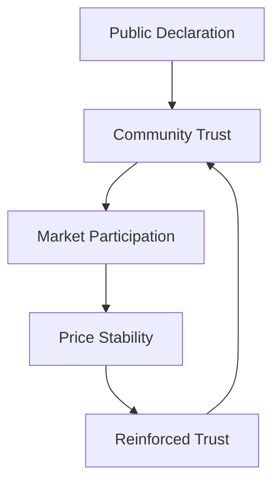

# Soft Peg 1:1 Strategy: Technical Documentation

## Executive Summary

This document outlines the technical implementation of a **Soft Peg 1:1 Strategy** for maintaining token price stability through community trust and market mechanisms, without algorithmic interventions or collateral backing.

## Table of Contents

1. [System Overview](#system-overview)
2. [Technical Architecture](#technical-architecture)
3. [Implementation Components](#implementation-components)
4. [Market Mechanisms](#market-mechanisms)
5. [Community Framework](#community-framework)
6. [Monitoring and Analytics](#monitoring-and-analytics)
7. [Risk Management](#risk-management)
8. [Performance Metrics](#performance-metrics)

## System Overview

### Concept Definition

A **Soft Peg** is a price stability mechanism that relies on:
- **Declarative Pricing**: Public announcement of 1:1 target rate
- **Community Consensus**: Voluntary adherence to target price
- **Market Self-Regulation**: Natural arbitrage and trading behavior
- **Trust-Based Stability**: No technical enforcement mechanisms

### Core Principles



### Key Characteristics

| Attribute | Value | Description |
|-----------|-------|-------------|
| **Enforcement** | None | No algorithmic price correction |
| **Backing** | Trust-based | Community confidence only |
| **Volatility** | Market-dependent | Subject to sentiment changes |
| **Scalability** | High | No technical constraints |
| **Complexity** | Low | Minimal infrastructure required |

## Technical Architecture

### System Components

```yaml
Soft Peg System:
  Core Components:
    - Declaration Module
    - Community Interface
    - Market Monitoring
    - Communication Layer
  
  External Dependencies:
    - DEX Platforms
    - Liquidity Pools
    - Price Oracles
    - Community Channels
```

### Infrastructure Requirements

#### Minimal Technical Stack

```json
{
  "blockchain_platform": "Cosmos SDK / Osmosis",
  "token_standard": "Native token",
  "dex_integration": "GAMM pools",
  "monitoring_tools": [
    "Price tracking APIs",
    "Volume analytics",
    "Community sentiment tools"
  ],
  "communication_channels": [
    "Official website",
    "Social media",
    "Community forums",
    "Developer documentation"
  ]
}
```

#### Pool Configuration

```json
{
  "pool_type": "balancer",
  "weights": {
    "NUAH": "50%",
    "USDT": "50%"
  },
  "initial_liquidity": {
    "NUAH": "1000000",
    "USDT": "1000000"
  },
  "fees": {
    "swap_fee": "0.1%",
    "exit_fee": "0%"
  },
  "governance": "community_managed"
}
```

## Implementation Components

### 1. Declaration Module

**Purpose**: Formal announcement and documentation of 1:1 peg commitment

```typescript
interface PegDeclaration {
  targetRatio: "1:1";
  baseToken: "NUAH";
  peggedTo: "USDT" | "USD" | "EUR";
  declarationDate: Date;
  commitment: {
    type: "soft_peg";
    enforcement: "community_based";
    duration: "indefinite";
  };
}
```

### 2. Community Interface

**Components**:
- Public dashboard showing current price vs target
- Community voting on peg-related decisions
- Educational resources about soft peg mechanics
- Feedback and suggestion systems

```html
<!-- Community Dashboard Example -->
<div class="peg-status">
  <h2>NUAH Soft Peg Status</h2>
  <div class="current-price">Current: $1.02</div>
  <div class="target-price">Target: $1.00</div>
  <div class="deviation">Deviation: +2%</div>
  <div class="community-sentiment">Community Confidence: 87%</div>
</div>
```

### 3. Market Monitoring System

**Real-time Tracking**:

```python
class SoftPegMonitor:
    def __init__(self):
        self.target_price = 1.0
        self.tolerance = 0.05  # 5% deviation threshold
        
    def check_price_deviation(self, current_price):
        deviation = abs(current_price - self.target_price) / self.target_price
        return {
            'current_price': current_price,
            'deviation_percent': deviation * 100,
            'within_tolerance': deviation <= self.tolerance,
            'alert_level': self.get_alert_level(deviation)
        }
    
    def get_alert_level(self, deviation):
        if deviation <= 0.02: return 'green'
        elif deviation <= 0.05: return 'yellow'
        else: return 'red'
```

## Market Mechanisms

### Natural Arbitrage

**Mechanism**: Price discrepancies create profit opportunities that naturally correct toward 1:1

```
If NUAH < $1.00:
  → Buy NUAH (cheap) → Sell for $1.00 → Profit
  → Increased demand raises NUAH price

If NUAH > $1.00:
  → Sell NUAH (expensive) → Buy at $1.00 → Profit
  → Increased supply lowers NUAH price
```

### Liquidity Provider Incentives

```json
{
  "incentive_structure": {
    "base_rewards": "Standard LP fees",
    "peg_maintenance_bonus": {
      "condition": "Price within ±2% of target",
      "bonus_rate": "1.5x normal fees"
    },
    "community_rewards": {
      "source": "Community treasury",
      "distribution": "Monthly based on peg stability"
    }
  }
}
```

### Trading Behavior Guidelines

**Community Trading Principles**:

1. **Preferred Trading Range**: $0.98 - $1.02
2. **Large Order Coordination**: Announce significant trades in advance
3. **Arbitrage Encouragement**: Reward users who help maintain peg
4. **Educational Trading**: Provide tools to understand price impact

## Community Framework

### Governance Structure

```yaml
Community Governance:
  Decision Making:
    - Soft consensus (no binding votes)
    - Community discussions
    - Transparent communication
  
  Key Roles:
    - Core Team: Project leadership and communication
    - Community Moderators: Discussion facilitation
    - Large Holders: Responsible trading practices
    - Liquidity Providers: Market stability support
  
  Communication Channels:
    - Weekly community calls
    - Discord/Telegram groups
    - Forum discussions
    - Social media updates
```

### Trust Building Mechanisms

**Transparency Measures**:

```json
{
  "transparency_framework": {
    "regular_reports": {
      "frequency": "weekly",
      "content": [
        "Price stability metrics",
        "Trading volume analysis",
        "Community sentiment survey",
        "Upcoming developments"
      ]
    },
    "open_communication": {
      "team_accessibility": "Daily office hours",
      "decision_transparency": "Public reasoning for all decisions",
      "financial_transparency": "Treasury and fund usage reports"
    }
  }
}
```

## Monitoring and Analytics

### Key Performance Indicators (KPIs)

```typescript
interface SoftPegKPIs {
  priceStability: {
    averageDeviation: number;        // Average % deviation from $1.00
    timeInRange: number;             // % of time within ±5% of target
    maxDeviation: number;            // Largest recorded deviation
    volatility: number;              // Price volatility index
  };
  
  communityHealth: {
    sentimentScore: number;          // Community confidence (0-100)
    activeParticipants: number;      // Regular community members
    tradingVolume: number;           // Daily/weekly trading activity
    liquidityDepth: number;          // Available liquidity in pools
  };
  
  marketMetrics: {
    arbitrageOpportunities: number;  // Frequency of profitable arbitrage
    largeOrderImpact: number;        // Price impact of significant trades
    recoveryTime: number;            // Time to return to peg after deviation
  };
}
```

### Monitoring Dashboard

```sql
-- Example monitoring queries
SELECT 
    DATE(timestamp) as date,
    AVG(price) as avg_price,
    ABS(AVG(price) - 1.0) as avg_deviation,
    MAX(price) as max_price,
    MIN(price) as min_price,
    STDDEV(price) as volatility
FROM price_history 
WHERE timestamp >= NOW() - INTERVAL 30 DAY
GROUP BY DATE(timestamp)
ORDER BY date DESC;
```

### Alert System

```python
class AlertSystem:
    def __init__(self):
        self.thresholds = {
            'minor_deviation': 0.03,    # 3%
            'major_deviation': 0.08,    # 8%
            'critical_deviation': 0.15  # 15%
        }
    
    def check_alerts(self, current_price):
        deviation = abs(current_price - 1.0)
        
        if deviation >= self.thresholds['critical_deviation']:
            self.send_critical_alert(current_price, deviation)
        elif deviation >= self.thresholds['major_deviation']:
            self.send_major_alert(current_price, deviation)
        elif deviation >= self.thresholds['minor_deviation']:
            self.send_minor_alert(current_price, deviation)
```

## Risk Management

### Identified Risks

| Risk Category | Risk Level | Mitigation Strategy |
|---------------|------------|--------------------|
| **Trust Erosion** | High | Transparent communication, consistent delivery |
| **Market Manipulation** | Medium | Community monitoring, large holder coordination |
| **Liquidity Crisis** | Medium | Diversified LP incentives, emergency protocols |
| **External Shocks** | High | Clear communication during crises |
| **Competitor Actions** | Low | Focus on unique value proposition |

### Crisis Response Protocols

```yaml
Crisis Response:
  Level 1 (Minor Deviation 3-8%):
    - Increase communication frequency
    - Analyze cause of deviation
    - Gentle community reminders about peg
  
  Level 2 (Major Deviation 8-15%):
    - Emergency community meeting
    - Detailed analysis and public report
    - Consider temporary incentive adjustments
  
  Level 3 (Critical Deviation >15%):
    - Immediate leadership response
    - Comprehensive review of peg strategy
    - Potential pivot to alternative mechanisms
```

## Performance Metrics

### Success Criteria

```json
{
  "success_metrics": {
    "short_term": {
      "price_stability": "±5% deviation max 90% of time",
      "community_growth": "20% monthly increase in active participants",
      "trading_volume": "Consistent daily volume >$10k"
    },
    "medium_term": {
      "price_stability": "±3% deviation max 95% of time",
      "market_recognition": "Listed on 3+ major DEX platforms",
      "ecosystem_adoption": "5+ projects accepting NUAH at par"
    },
    "long_term": {
      "price_stability": "±2% deviation max 98% of time",
      "institutional_adoption": "Recognition by major DeFi protocols",
      "sustainable_ecosystem": "Self-sustaining community governance"
    }
  }
}
```

### Evaluation Framework

```python
def evaluate_soft_peg_performance(data_period_days=30):
    metrics = {
        'stability_score': calculate_stability_score(),
        'community_health': assess_community_metrics(),
        'market_efficiency': measure_arbitrage_effectiveness(),
        'trust_index': survey_community_confidence()
    }
    
    overall_score = weighted_average(metrics, {
        'stability_score': 0.4,
        'community_health': 0.3,
        'market_efficiency': 0.2,
        'trust_index': 0.1
    })
    
    return {
        'overall_performance': overall_score,
        'detailed_metrics': metrics,
        'recommendations': generate_recommendations(metrics)
    }
```

---

## Conclusion

The Soft Peg 1:1 Strategy represents a minimalist approach to price stability that leverages community trust and market mechanisms. Success depends on:

1. **Strong Community Foundation**: Active, engaged, and trusting user base
2. **Transparent Communication**: Regular, honest updates about project status
3. **Market Education**: Helping users understand and support the peg mechanism
4. **Continuous Monitoring**: Real-time tracking and responsive adjustments
5. **Crisis Preparedness**: Clear protocols for handling market stress

While this approach carries inherent risks due to its reliance on social consensus rather than technical guarantees, it offers simplicity, scalability, and alignment with decentralized principles.

---

*Document Version: 1.0*  
*Last Updated: January 2025*  
*Next Review: Quarterly*