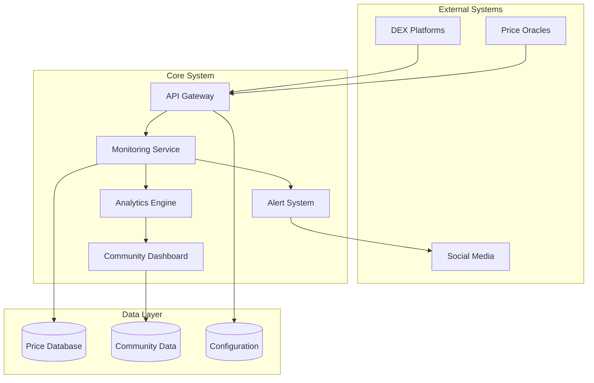

# Technical Specification (TS): Soft Peg 1:1 Implementation

**Document Type**: Technical Specification  
**Project**: NUAH Token Soft Peg Strategy  
**Version**: 1.0  
**Date**: January 2025  
**Status**: Draft

## Document Control

| Field | Value |
|-------|-------|
| **Document ID** | TS-NUAH-SOFTPEG-001 |
| **Classification** | Technical Specification |
| **Author(s)** | Development Team |
| **Reviewer(s)** | Technical Lead, Community |
| **Approval** | Project Manager |

---

## 1. Introduction

### 1.1 Purpose

This Technical Specification defines the implementation requirements for a Soft Peg 1:1 strategy for the NUAH token, establishing a trust-based price stability mechanism without algorithmic enforcement.

### 1.2 Scope

This specification covers:
- System architecture and components
- Implementation requirements
- Interface specifications
- Performance criteria
- Testing requirements
- Deployment procedures

### 1.3 Definitions

| Term | Definition |
|------|------------|
| **Soft Peg** | Price stability mechanism based on community consensus |
| **Target Rate** | Declared 1:1 exchange rate (1 NUAH = 1 USD equivalent) |
| **Deviation Threshold** | Acceptable price variance from target (±5%) |
| **Community Consensus** | Collective agreement to maintain target rate |
| **Trust Index** | Quantitative measure of community confidence |

---

## 2. System Requirements

### 2.1 Functional Requirements

#### FR-001: Price Declaration System
**Priority**: Critical  
**Description**: System must provide mechanism to declare and maintain 1:1 peg commitment

```yaml
Requirement: FR-001
Inputs:
  - Target ratio (1:1)
  - Base token (NUAH)
  - Reference currency (USDT/USD)
  - Declaration timestamp
Outputs:
  - Public peg declaration
  - Commitment record
  - Community notification
Validation:
  - Declaration must be immutable once published
  - Must include clear terms and conditions
  - Must be accessible to all community members
```

#### FR-002: Community Interface
**Priority**: High  
**Description**: Web interface for community interaction and monitoring

```typescript
interface CommunityDashboard {
  // Real-time price display
  getCurrentPrice(): Promise<PriceData>;
  
  // Historical price chart
  getPriceHistory(timeframe: TimeFrame): Promise<PricePoint[]>;
  
  // Community sentiment
  getCommunityMetrics(): Promise<CommunityHealth>;
  
  // Educational resources
  getEducationalContent(): Promise<Resource[]>;
  
  // Feedback submission
  submitFeedback(feedback: CommunityFeedback): Promise<void>;
}

interface PriceData {
  current: number;
  target: number;
  deviation: number;
  timestamp: Date;
  confidence: number;
}
```

#### FR-003: Monitoring System
**Priority**: High  
**Description**: Real-time price and market monitoring with alerting

```python
class MonitoringSystem:
    def __init__(self, config: MonitoringConfig):
        self.price_sources = config.price_sources
        self.alert_thresholds = config.thresholds
        self.notification_channels = config.channels
    
    def monitor_price_deviation(self) -> MonitoringResult:
        """Continuously monitor price against target"""
        pass
    
    def generate_alerts(self, deviation: float) -> List[Alert]:
        """Generate appropriate alerts based on deviation level"""
        pass
    
    def collect_market_data(self) -> MarketData:
        """Aggregate data from multiple sources"""
        pass
```

### 2.2 Non-Functional Requirements

#### NFR-001: Performance
- **Response Time**: Web interface < 2 seconds
- **Data Refresh**: Price updates every 30 seconds
- **Availability**: 99.5% uptime
- **Scalability**: Support 10,000+ concurrent users

#### NFR-002: Security
- **Data Integrity**: Cryptographic verification of price data
- **Access Control**: Role-based permissions
- **Audit Trail**: Complete logging of all system actions
- **Privacy**: No personal data collection without consent

#### NFR-003: Usability
- **Accessibility**: WCAG 2.1 AA compliance
- **Mobile Support**: Responsive design for all devices
- **Internationalization**: Multi-language support
- **User Experience**: Intuitive navigation and clear information hierarchy

---

## 3. System Architecture

### 3.1 High-Level Architecture



### 3.2 Component Specifications

#### 3.2.1 API Gateway

```yaml
Component: API Gateway
Technology: Node.js + Express
Responsibilities:
  - Route external requests
  - Rate limiting
  - Authentication
  - Data validation
  
Endpoints:
  GET /api/v1/price/current:
    description: "Get current NUAH price"
    response: PriceData
    cache_ttl: 30s
  
  GET /api/v1/price/history:
    description: "Get historical price data"
    parameters:
      - timeframe: string (1h, 24h, 7d, 30d)
      - limit: number (max 1000)
    response: PricePoint[]
  
  GET /api/v1/community/metrics:
    description: "Get community health metrics"
    response: CommunityHealth
    cache_ttl: 5m
```

#### 3.2.2 Monitoring Service

```python
# monitoring_service.py
class MonitoringService:
    def __init__(self):
        self.price_aggregator = PriceAggregator()
        self.deviation_calculator = DeviationCalculator()
        self.alert_manager = AlertManager()
    
    async def run_monitoring_cycle(self):
        """Main monitoring loop"""
        while True:
            try:
                # Collect price data
                current_price = await self.price_aggregator.get_current_price()
                
                # Calculate deviation
                deviation = self.deviation_calculator.calculate(current_price, 1.0)
                
                # Store data
                await self.store_price_data(current_price, deviation)
                
                # Check for alerts
                if abs(deviation) > self.alert_threshold:
                    await self.alert_manager.trigger_alert(deviation)
                
                await asyncio.sleep(30)  # 30-second intervals
                
            except Exception as e:
                logger.error(f"Monitoring cycle error: {e}")
                await asyncio.sleep(60)  # Longer wait on error
```

#### 3.2.3 Community Dashboard

```typescript
// dashboard.tsx
import React, { useState, useEffect } from 'react';

interface DashboardProps {
  apiClient: ApiClient;
}

export const CommunityDashboard: React.FC<DashboardProps> = ({ apiClient }) => {
  const [priceData, setPriceData] = useState<PriceData | null>(null);
  const [communityMetrics, setCommunityMetrics] = useState<CommunityHealth | null>(null);
  
  useEffect(() => {
    const fetchData = async () => {
      try {
        const [price, community] = await Promise.all([
          apiClient.getCurrentPrice(),
          apiClient.getCommunityMetrics()
        ]);
        
        setPriceData(price);
        setCommunityMetrics(community);
      } catch (error) {
        console.error('Failed to fetch dashboard data:', error);
      }
    };
    
    fetchData();
    const interval = setInterval(fetchData, 30000); // Update every 30s
    
    return () => clearInterval(interval);
  }, [apiClient]);
  
  return (
    <div className="dashboard">
      <PriceWidget data={priceData} />
      <CommunityWidget metrics={communityMetrics} />
      <HistoricalChart />
      <EducationalResources />
    </div>
  );
};
```

---

## 4. Data Specifications

### 4.1 Data Models

#### 4.1.1 Price Data Model

```sql
CREATE TABLE price_history (
    id BIGSERIAL PRIMARY KEY,
    timestamp TIMESTAMP WITH TIME ZONE NOT NULL,
    price DECIMAL(18, 8) NOT NULL,
    volume_24h DECIMAL(18, 8),
    source VARCHAR(50) NOT NULL,
    deviation_percent DECIMAL(8, 4),
    market_cap DECIMAL(18, 2),
    created_at TIMESTAMP WITH TIME ZONE DEFAULT NOW()
);

CREATE INDEX idx_price_history_timestamp ON price_history(timestamp);
CREATE INDEX idx_price_history_source ON price_history(source);
```

#### 4.1.2 Community Metrics Model

```sql
CREATE TABLE community_metrics (
    id BIGSERIAL PRIMARY KEY,
    date DATE NOT NULL,
    active_users INTEGER,
    sentiment_score DECIMAL(3, 2), -- 0.00 to 1.00
    trading_volume DECIMAL(18, 8),
    liquidity_depth DECIMAL(18, 8),
    forum_activity INTEGER,
    social_mentions INTEGER,
    created_at TIMESTAMP WITH TIME ZONE DEFAULT NOW()
);

CREATE UNIQUE INDEX idx_community_metrics_date ON community_metrics(date);
```

#### 4.1.3 Alert Configuration Model

```json
{
  "alert_config": {
    "thresholds": {
      "minor_deviation": 0.03,
      "major_deviation": 0.08,
      "critical_deviation": 0.15
    },
    "channels": {
      "discord": {
        "enabled": true,
        "webhook_url": "https://discord.com/api/webhooks/...",
        "mention_roles": ["@community-managers"]
      },
      "telegram": {
        "enabled": true,
        "bot_token": "...",
        "chat_id": "..."
      },
      "email": {
        "enabled": false,
        "smtp_config": {...}
      }
    },
    "cooldown_minutes": 15
  }
}
```

### 4.2 API Specifications

#### 4.2.1 REST API Endpoints

```yaml
openapi: 3.0.0
info:
  title: NUAH Soft Peg API
  version: 1.0.0
  description: API for NUAH soft peg monitoring and community interaction

paths:
  /api/v1/price/current:
    get:
      summary: Get current NUAH price
      responses:
        '200':
          description: Current price data
          content:
            application/json:
              schema:
                $ref: '#/components/schemas/PriceData'
  
  /api/v1/community/sentiment:
    get:
      summary: Get community sentiment metrics
      responses:
        '200':
          description: Community sentiment data
          content:
            application/json:
              schema:
                $ref: '#/components/schemas/CommunityHealth'
    
    post:
      summary: Submit community feedback
      requestBody:
        required: true
        content:
          application/json:
            schema:
              $ref: '#/components/schemas/FeedbackSubmission'
      responses:
        '201':
          description: Feedback submitted successfully

components:
  schemas:
    PriceData:
      type: object
      properties:
        current:
          type: number
          format: float
          example: 1.02
        target:
          type: number
          format: float
          example: 1.00
        deviation:
          type: number
          format: float
          example: 0.02
        timestamp:
          type: string
          format: date-time
        confidence:
          type: number
          format: float
          minimum: 0
          maximum: 1
```

---

## 5. Implementation Requirements

### 5.1 Development Environment

```yaml
Development Stack:
  Backend:
    - Runtime: Node.js 18+
    - Framework: Express.js
    - Database: PostgreSQL 14+
    - Cache: Redis 6+
    - Message Queue: Bull (Redis-based)
  
  Frontend:
    - Framework: React 18+
    - Build Tool: Vite
    - Styling: Tailwind CSS
    - Charts: Chart.js / D3.js
    - State Management: Zustand
  
  Infrastructure:
    - Containerization: Docker
    - Orchestration: Docker Compose (dev), Kubernetes (prod)
    - Monitoring: Prometheus + Grafana
    - Logging: Winston + ELK Stack
  
  External Services:
    - Price Data: CoinGecko API, DEX APIs
    - Notifications: Discord/Telegram webhooks
    - Analytics: Custom analytics service
```

### 5.2 Configuration Management

```typescript
// config.ts
export interface AppConfig {
  server: {
    port: number;
    host: string;
    cors: {
      origin: string[];
      credentials: boolean;
    };
  };
  
  database: {
    host: string;
    port: number;
    name: string;
    username: string;
    password: string;
    ssl: boolean;
  };
  
  monitoring: {
    priceUpdateInterval: number; // seconds
    alertThresholds: {
      minor: number;
      major: number;
      critical: number;
    };
    dataSources: {
      primary: string;
      fallback: string[];
    };
  };
  
  community: {
    targetPrice: number;
    tolerancePercent: number;
    sentimentUpdateInterval: number;
  };
}

// Load configuration from environment
export const config: AppConfig = {
  server: {
    port: parseInt(process.env.PORT || '3000'),
    host: process.env.HOST || 'localhost',
    cors: {
      origin: process.env.CORS_ORIGINS?.split(',') || ['http://localhost:3000'],
      credentials: true
    }
  },
  // ... rest of configuration
};
```

### 5.3 Deployment Specifications

#### 5.3.1 Docker Configuration

```dockerfile
# Dockerfile
FROM node:18-alpine AS builder

WORKDIR /app
COPY package*.json ./
RUN npm ci --only=production

COPY . .
RUN npm run build

FROM node:18-alpine AS runtime

WORKDIR /app
COPY --from=builder /app/dist ./dist
COPY --from=builder /app/node_modules ./node_modules
COPY --from=builder /app/package.json ./package.json

EXPOSE 3000

USER node
CMD ["npm", "start"]
```

#### 5.3.2 Docker Compose

```yaml
# docker-compose.yml
version: '3.8'

services:
  app:
    build: .
    ports:
      - "3000:3000"
    environment:
      - NODE_ENV=production
      - DATABASE_URL=postgresql://user:pass@db:5432/nuah_softpeg
      - REDIS_URL=redis://redis:6379
    depends_on:
      - db
      - redis
    restart: unless-stopped
  
  db:
    image: postgres:14-alpine
    environment:
      - POSTGRES_DB=nuah_softpeg
      - POSTGRES_USER=user
      - POSTGRES_PASSWORD=pass
    volumes:
      - postgres_data:/var/lib/postgresql/data
      - ./init.sql:/docker-entrypoint-initdb.d/init.sql
    restart: unless-stopped
  
  redis:
    image: redis:6-alpine
    restart: unless-stopped
  
  monitoring:
    image: prom/prometheus
    ports:
      - "9090:9090"
    volumes:
      - ./prometheus.yml:/etc/prometheus/prometheus.yml
    restart: unless-stopped

volumes:
  postgres_data:
```

---

## 6. Testing Requirements

### 6.1 Unit Testing

```typescript
// price-monitor.test.ts
import { PriceMonitor } from '../src/services/PriceMonitor';
import { MockPriceSource } from './mocks/MockPriceSource';

describe('PriceMonitor', () => {
  let priceMonitor: PriceMonitor;
  let mockPriceSource: MockPriceSource;
  
  beforeEach(() => {
    mockPriceSource = new MockPriceSource();
    priceMonitor = new PriceMonitor([mockPriceSource]);
  });
  
  describe('calculateDeviation', () => {
    it('should calculate positive deviation correctly', () => {
      const result = priceMonitor.calculateDeviation(1.05, 1.0);
      expect(result).toBe(0.05);
    });
    
    it('should calculate negative deviation correctly', () => {
      const result = priceMonitor.calculateDeviation(0.95, 1.0);
      expect(result).toBe(-0.05);
    });
  });
  
  describe('shouldTriggerAlert', () => {
    it('should trigger alert for major deviation', () => {
      const shouldAlert = priceMonitor.shouldTriggerAlert(0.08);
      expect(shouldAlert).toBe(true);
    });
    
    it('should not trigger alert for minor deviation', () => {
      const shouldAlert = priceMonitor.shouldTriggerAlert(0.02);
      expect(shouldAlert).toBe(false);
    });
  });
});
```

### 6.2 Integration Testing

```python
# test_api_integration.py
import pytest
import requests
from datetime import datetime, timedelta

class TestAPIIntegration:
    def setup_method(self):
        self.base_url = "http://localhost:3000/api/v1"
        self.headers = {"Content-Type": "application/json"}
    
    def test_get_current_price(self):
        response = requests.get(f"{self.base_url}/price/current")
        
        assert response.status_code == 200
        data = response.json()
        
        assert "current" in data
        assert "target" in data
        assert "deviation" in data
        assert "timestamp" in data
        assert isinstance(data["current"], (int, float))
        assert data["target"] == 1.0
    
    def test_get_price_history(self):
        params = {"timeframe": "24h", "limit": 100}
        response = requests.get(f"{self.base_url}/price/history", params=params)
        
        assert response.status_code == 200
        data = response.json()
        
        assert isinstance(data, list)
        assert len(data) <= 100
        
        if data:
            point = data[0]
            assert "price" in point
            assert "timestamp" in point
            assert "volume" in point
```

### 6.3 Performance Testing

```javascript
// load-test.js (using k6)
import http from 'k6/http';
import { check, sleep } from 'k6';

export let options = {
  stages: [
    { duration: '2m', target: 100 }, // Ramp up
    { duration: '5m', target: 100 }, // Stay at 100 users
    { duration: '2m', target: 200 }, // Ramp up to 200
    { duration: '5m', target: 200 }, // Stay at 200
    { duration: '2m', target: 0 },   // Ramp down
  ],
  thresholds: {
    http_req_duration: ['p(95)<2000'], // 95% of requests under 2s
    http_req_failed: ['rate<0.1'],     // Error rate under 10%
  },
};

export default function () {
  // Test current price endpoint
  let response = http.get('http://localhost:3000/api/v1/price/current');
  check(response, {
    'status is 200': (r) => r.status === 200,
    'response time < 2s': (r) => r.timings.duration < 2000,
    'has price data': (r) => JSON.parse(r.body).current !== undefined,
  });
  
  sleep(1);
  
  // Test community metrics endpoint
  response = http.get('http://localhost:3000/api/v1/community/metrics');
  check(response, {
    'community metrics status is 200': (r) => r.status === 200,
    'community response time < 2s': (r) => r.timings.duration < 2000,
  });
  
  sleep(1);
}
```

---

## 7. Security Requirements

### 7.1 Security Controls

```typescript
// security-middleware.ts
import rateLimit from 'express-rate-limit';
import helmet from 'helmet';
import cors from 'cors';

// Rate limiting
export const apiLimiter = rateLimit({
  windowMs: 15 * 60 * 1000, // 15 minutes
  max: 100, // Limit each IP to 100 requests per windowMs
  message: 'Too many requests from this IP',
  standardHeaders: true,
  legacyHeaders: false,
});

// Strict rate limiting for sensitive endpoints
export const strictLimiter = rateLimit({
  windowMs: 15 * 60 * 1000,
  max: 10,
  message: 'Rate limit exceeded for sensitive endpoint',
});

// Security headers
export const securityHeaders = helmet({
  contentSecurityPolicy: {
    directives: {
      defaultSrc: ["'self'"],
      styleSrc: ["'self'", "'unsafe-inline'"],
      scriptSrc: ["'self'"],
      imgSrc: ["'self'", "data:", "https:"],
      connectSrc: ["'self'", "wss:"],
    },
  },
  hsts: {
    maxAge: 31536000,
    includeSubDomains: true,
    preload: true,
  },
});

// CORS configuration
export const corsOptions = {
  origin: process.env.ALLOWED_ORIGINS?.split(',') || ['http://localhost:3000'],
  credentials: true,
  optionsSuccessStatus: 200,
};
```

### 7.2 Data Validation

```typescript
// validation-schemas.ts
import Joi from 'joi';

export const priceDataSchema = Joi.object({
  price: Joi.number().positive().precision(8).required(),
  timestamp: Joi.date().iso().required(),
  source: Joi.string().max(50).required(),
  volume: Joi.number().positive().optional(),
});

export const feedbackSchema = Joi.object({
  rating: Joi.number().integer().min(1).max(5).required(),
  comment: Joi.string().max(1000).optional(),
  category: Joi.string().valid('price', 'community', 'technical', 'other').required(),
  anonymous: Joi.boolean().default(true),
});

export const timeframeSchema = Joi.string().valid('1h', '24h', '7d', '30d').required();
```

---

## 8. Monitoring and Observability

### 8.1 Metrics Collection

```typescript
// metrics.ts
import { register, Counter, Histogram, Gauge } from 'prom-client';

// Custom metrics
export const priceDeviationGauge = new Gauge({
  name: 'nuah_price_deviation_percent',
  help: 'Current price deviation from target (1.0) in percent',
});

export const apiRequestsTotal = new Counter({
  name: 'api_requests_total',
  help: 'Total number of API requests',
  labelNames: ['method', 'route', 'status'],
});

export const apiRequestDuration = new Histogram({
  name: 'api_request_duration_seconds',
  help: 'API request duration in seconds',
  labelNames: ['method', 'route'],
  buckets: [0.1, 0.5, 1, 2, 5],
});

export const communityHealthGauge = new Gauge({
  name: 'community_health_score',
  help: 'Community health score (0-1)',
});

export const alertsTriggeredTotal = new Counter({
  name: 'alerts_triggered_total',
  help: 'Total number of alerts triggered',
  labelNames: ['severity', 'type'],
});

// Middleware to collect metrics
export const metricsMiddleware = (req: Request, res: Response, next: NextFunction) => {
  const start = Date.now();
  
  res.on('finish', () => {
    const duration = (Date.now() - start) / 1000;
    
    apiRequestsTotal
      .labels(req.method, req.route?.path || req.path, res.statusCode.toString())
      .inc();
    
    apiRequestDuration
      .labels(req.method, req.route?.path || req.path)
      .observe(duration);
  });
  
  next();
};
```

### 8.2 Logging Configuration

```typescript
// logger.ts
import winston from 'winston';

const logFormat = winston.format.combine(
  winston.format.timestamp(),
  winston.format.errors({ stack: true }),
  winston.format.json()
);

export const logger = winston.createLogger({
  level: process.env.LOG_LEVEL || 'info',
  format: logFormat,
  defaultMeta: { service: 'nuah-softpeg' },
  transports: [
    new winston.transports.File({ filename: 'logs/error.log', level: 'error' }),
    new winston.transports.File({ filename: 'logs/combined.log' }),
  ],
});

if (process.env.NODE_ENV !== 'production') {
  logger.add(new winston.transports.Console({
    format: winston.format.combine(
      winston.format.colorize(),
      winston.format.simple()
    )
  }));
}

// Structured logging helpers
export const logPriceUpdate = (price: number, deviation: number, source: string) => {
  logger.info('Price updated', {
    event: 'price_update',
    price,
    deviation,
    source,
    timestamp: new Date().toISOString(),
  });
};

export const logAlert = (severity: string, message: string, data?: any) => {
  logger.warn('Alert triggered', {
    event: 'alert_triggered',
    severity,
    message,
    data,
    timestamp: new Date().toISOString(),
  });
};
```

---

## 9. Deployment and Operations

### 9.1 Deployment Pipeline

```yaml
# .github/workflows/deploy.yml
name: Deploy Soft Peg System

on:
  push:
    branches: [main]
  pull_request:
    branches: [main]

jobs:
  test:
    runs-on: ubuntu-latest
    steps:
      - uses: actions/checkout@v3
      - uses: actions/setup-node@v3
        with:
          node-version: '18'
          cache: 'npm'
      
      - run: npm ci
      - run: npm run lint
      - run: npm run test
      - run: npm run test:integration
  
  build:
    needs: test
    runs-on: ubuntu-latest
    if: github.ref == 'refs/heads/main'
    
    steps:
      - uses: actions/checkout@v3
      
      - name: Build Docker image
        run: |
          docker build -t nuah-softpeg:${{ github.sha }} .
          docker tag nuah-softpeg:${{ github.sha }} nuah-softpeg:latest
      
      - name: Push to registry
        run: |
          echo ${{ secrets.DOCKER_PASSWORD }} | docker login -u ${{ secrets.DOCKER_USERNAME }} --password-stdin
          docker push nuah-softpeg:${{ github.sha }}
          docker push nuah-softpeg:latest
  
  deploy:
    needs: build
    runs-on: ubuntu-latest
    if: github.ref == 'refs/heads/main'
    
    steps:
      - name: Deploy to production
        run: |
          # Deploy using your preferred method (kubectl, docker-compose, etc.)
          echo "Deploying to production..."
```

### 9.2 Health Checks

```typescript
// health.ts
export interface HealthCheck {
  name: string;
  status: 'healthy' | 'unhealthy' | 'degraded';
  message?: string;
  timestamp: Date;
}

export class HealthChecker {
  private checks: Map<string, () => Promise<HealthCheck>> = new Map();
  
  constructor() {
    this.registerCheck('database', this.checkDatabase.bind(this));
    this.registerCheck('redis', this.checkRedis.bind(this));
    this.registerCheck('price-sources', this.checkPriceSources.bind(this));
  }
  
  registerCheck(name: string, check: () => Promise<HealthCheck>) {
    this.checks.set(name, check);
  }
  
  async runAllChecks(): Promise<{ overall: string; checks: HealthCheck[] }> {
    const results: HealthCheck[] = [];
    
    for (const [name, check] of this.checks) {
      try {
        const result = await Promise.race([
          check(),
          new Promise<HealthCheck>((_, reject) => 
            setTimeout(() => reject(new Error('Timeout')), 5000)
          )
        ]);
        results.push(result);
      } catch (error) {
        results.push({
          name,
          status: 'unhealthy',
          message: error.message,
          timestamp: new Date()
        });
      }
    }
    
    const overall = results.every(r => r.status === 'healthy') 
      ? 'healthy' 
      : results.some(r => r.status === 'unhealthy') 
        ? 'unhealthy' 
        : 'degraded';
    
    return { overall, checks: results };
  }
  
  private async checkDatabase(): Promise<HealthCheck> {
    // Implementation for database health check
    return {
      name: 'database',
      status: 'healthy',
      timestamp: new Date()
    };
  }
  
  private async checkRedis(): Promise<HealthCheck> {
    // Implementation for Redis health check
    return {
      name: 'redis',
      status: 'healthy',
      timestamp: new Date()
    };
  }
  
  private async checkPriceSources(): Promise<HealthCheck> {
    // Implementation for price source health check
    return {
      name: 'price-sources',
      status: 'healthy',
      timestamp: new Date()
    };
  }
}
```

---

## 10. Acceptance Criteria

### 10.1 Functional Acceptance

- [ ] System displays current NUAH price with <2 second response time
- [ ] Price deviation from 1:1 target is calculated and displayed accurately
- [ ] Historical price data is available for 1h, 24h, 7d, 30d timeframes
- [ ] Community dashboard loads and updates every 30 seconds
- [ ] Alert system triggers notifications at configured deviation thresholds
- [ ] Community feedback can be submitted and stored
- [ ] Educational resources are accessible and up-to-date

### 10.2 Performance Acceptance

- [ ] API endpoints respond within 2 seconds for 95% of requests
- [ ] System supports 1000+ concurrent users without degradation
- [ ] Price data updates every 30 seconds from multiple sources
- [ ] Database queries complete within 500ms for standard operations
- [ ] System maintains 99.5% uptime over 30-day periods

### 10.3 Security Acceptance

- [ ] All API endpoints implement rate limiting
- [ ] Input validation prevents injection attacks
- [ ] HTTPS enforced for all communications
- [ ] Security headers properly configured
- [ ] Audit logging captures all significant events
- [ ] No sensitive data exposed in logs or error messages

### 10.4 Usability Acceptance

- [ ] Dashboard is responsive on mobile and desktop devices
- [ ] Interface meets WCAG 2.1 AA accessibility standards
- [ ] Navigation is intuitive for new users
- [ ] Error messages are clear and actionable
- [ ] Loading states provide appropriate feedback

---

## 11. Maintenance and Support

### 11.1 Operational Procedures

```bash
#!/bin/bash
# operational-scripts/backup.sh

# Database backup
pg_dump $DATABASE_URL > backups/db_$(date +%Y%m%d_%H%M%S).sql

# Log rotation
find logs/ -name "*.log" -mtime +7 -delete

# Health check
curl -f http://localhost:3000/health || exit 1

echo "Maintenance completed successfully"
```

### 11.2 Monitoring Alerts

```yaml
# prometheus-alerts.yml
groups:
  - name: nuah-softpeg
    rules:
      - alert: HighPriceDeviation
        expr: abs(nuah_price_deviation_percent) > 8
        for: 5m
        labels:
          severity: warning
        annotations:
          summary: "NUAH price deviation exceeds 8%"
          description: "Price has deviated {{ $value }}% from target for 5+ minutes"
      
      - alert: CriticalPriceDeviation
        expr: abs(nuah_price_deviation_percent) > 15
        for: 1m
        labels:
          severity: critical
        annotations:
          summary: "CRITICAL: NUAH price deviation exceeds 15%"
          description: "Price has deviated {{ $value }}% from target"
      
      - alert: APIHighLatency
        expr: histogram_quantile(0.95, api_request_duration_seconds) > 2
        for: 10m
        labels:
          severity: warning
        annotations:
          summary: "API response time is high"
          description: "95th percentile latency is {{ $value }}s"
```

---

## Appendices

### Appendix A: Glossary

| Term | Definition |
|------|------------|
| **API Gateway** | Entry point for all API requests, handling routing and authentication |
| **Community Health** | Quantitative measure of community engagement and sentiment |
| **Deviation Threshold** | Percentage variance from target price that triggers alerts |
| **Liquidity Pool** | Smart contract containing token reserves for trading |
| **Price Oracle** | External service providing market price data |
| **Soft Peg** | Price stability mechanism based on community consensus |
| **Trust Index** | Metric measuring community confidence in the peg |

### Appendix B: References

- [Osmosis Documentation](https://docs.osmosis.zone/)
- [GAMM Module Specification](https://github.com/osmosis-labs/osmosis/tree/main/x/gamm)
- [Cosmos SDK Documentation](https://docs.cosmos.network/)
- [Express.js Security Best Practices](https://expressjs.com/en/advanced/best-practice-security.html)
- [React Performance Optimization](https://react.dev/learn/render-and-commit)

### Appendix C: Change Log

| Version | Date | Changes | Author |
|---------|------|---------|--------|
| 1.0 | 2025-01-XX | Initial specification | Development Team |

---

**Document Status**: Draft  
**Next Review Date**: 2025-02-XX  
**Approval Required**: Technical Lead, Project Manager